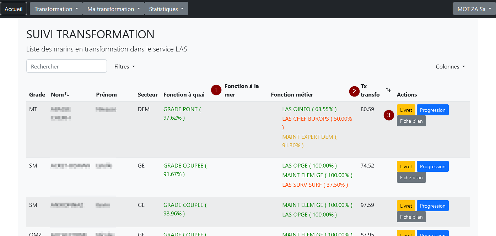
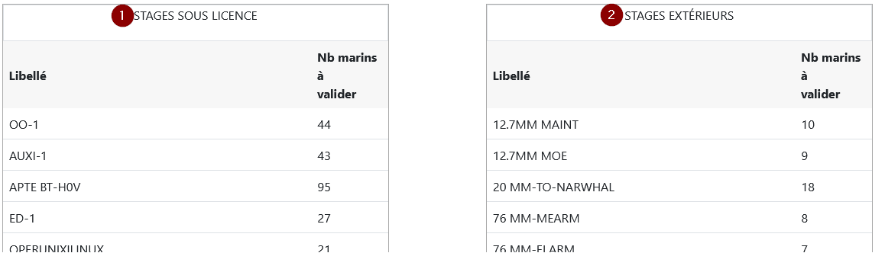
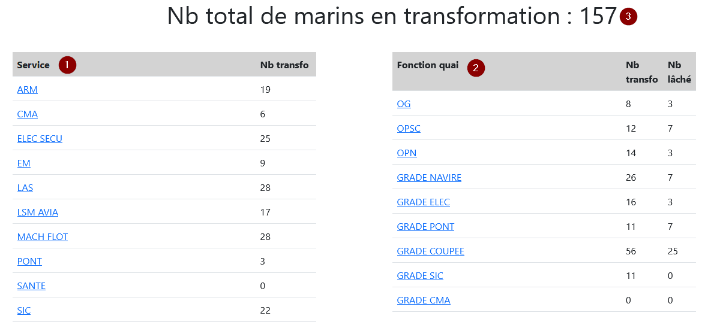
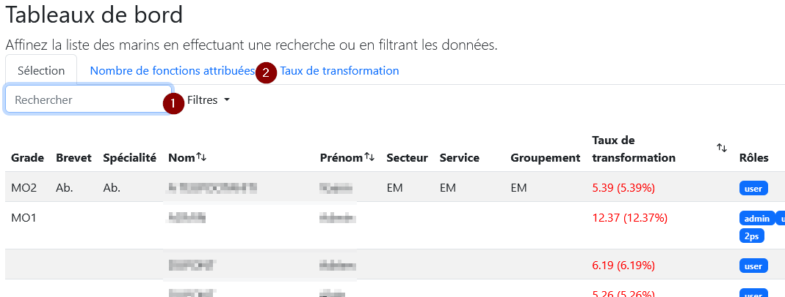
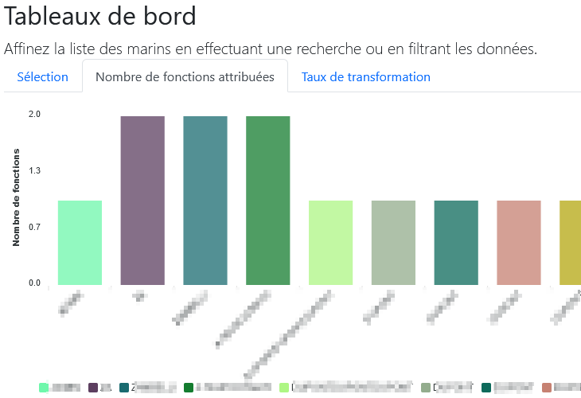
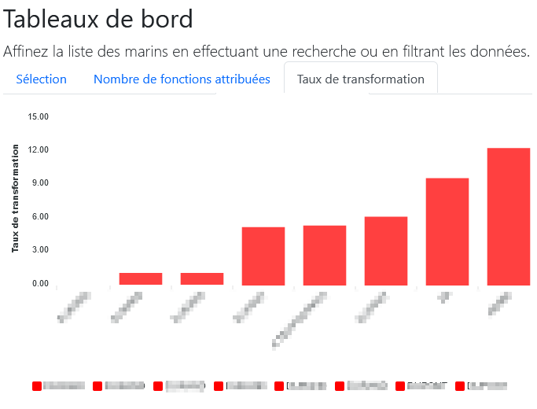
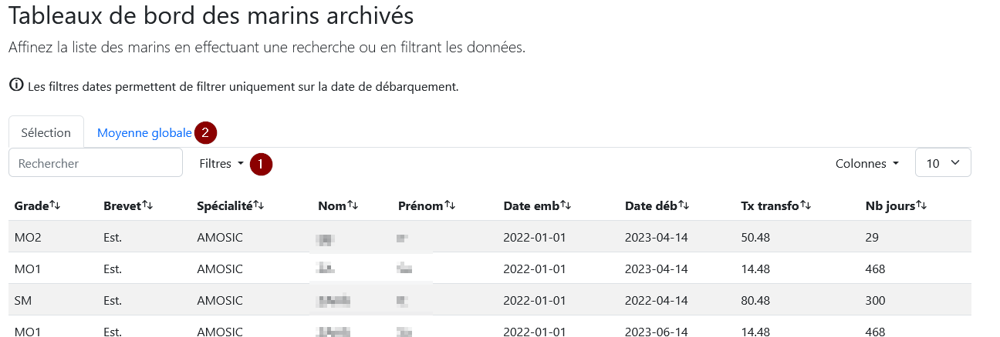
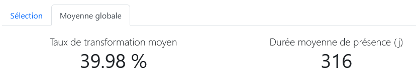

# Statistiques

- [Bilan par service](#bilan-service)
- [Bilan par stage](#bilan-stage)
- [Bilan global](#bilan-global)
- [Tableau de bord](#tableau-bord)
- [Archives](#archives)

> {info} Pour exporter ces tableaux sous Excel, sélectionnez toutes les cases souhaitées en maintenant enfoncée la touche « Ctrl » de votre clavier puis copiez et collez dans votre fichier Excel.

## Bilan par service
Page permettant d’afficher le tableau récapitulatif des taux de transformation des marins d'un service.

Pour chaque marin, vous pouvez consulter l’ensemble des fonctions qui lui sont attribuées (1) et son taux de transformation global(2). Vous pouvez accéder à son livret, ses courbes de progression et sa fiche bilan avec les boutons(3).

** Remarque : **
Seuls les marins ayant au moins une fonction attribuée apparaissent dans cette liste.

** Remarque : ** Le logo &#128232; signale que le marin a des objectifs en attente de validation.

## Bilan par stage
Page permettant d’afficher le tableau récapitulatif du nombre de marins en attente de validation d’un stage sous licence (1) et d'un tableau récapitulant le nombre de marins en attente de validation d’un stage extérieur (2).

** Remarque : ** Cliquez sur le nom d'un stage pour afficher la situation des marins concernés.

## Bilan global
Page permettant d’afficher un tableau récapitulant le nombre de marins en transformation par service(1) et un tableau récapitulant le nombre de marins en transformation par fonction de service à quai (2).

** Remarque : ** En cliquant sur un service ou une fonction de service à quai, vous affichez la liste des marins concernés.

## Tableau de bord
Page permettant d'afficher un tableau récapitulant les marins en transformation en fonction des critères sélectionnés (1). Vous devez saisir au moins 1 critère pour pouvoir afficher les tableaux (2).

Dans l'onglet "Nombre de fonctions attribuées", vous trouvez un graphique avec la liste des marins sélectionnés et le nombre de fonctions attribuées.

Dans l'onglet "Taux de transformation", vous trouvez un graphique avec la liste des marins sélectionnés et leur taux de transformation

## Archives
Page permettant d'afficher un tableau récapitulant tous les marins archivés.

Saisissez les critères de filtre (1) dans l'onglet "Sélection" pour affiner l'affichage. Vous trouverez dans l'onglet "Moyenne globale" (2) le taux de transformation et le temps de présence au GTR.

** Remarque : ** Les filtres dates permettent de filtrer uniquement sur la date de débarquement.