# Transformation

- [Suivi de la transformation par marin](#suivi-par-marin)
   - [Attribuer des fonction](#attribuer-des-fonctions)
   - [Livret de transformation](#livret-de-transformation)
   - [Progression](#progression)
   - [Fiche bilan](#fiche-bilan)
   - [Stages](#stages)
- [Suivi de la transformation par fonction](#suivi-par-fonction)
- [Suivi de la transformation par compagnonnage](#suivi-par-compagnonnage)
- [Suivi de la transformation par stage](#suivi-par-stage)
- [Recalcul des taux de transformation](#recalcul-transfo)
- [Parcours des fiches bilan](#parcours-fiche-bilan)
- [Ma transformation](#ma-transformation)

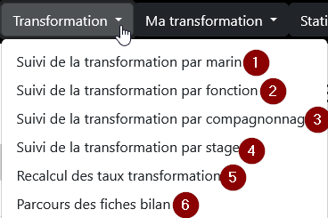

Ce menu permet d’accéder : 
 
1. à la liste des marins en cours de transformation. Un lien vers son livret de transformation permet la validation d’objectifs.
2. à la liste des fonctions. Un lien vers le livret associé à la fonction permet la validation collective d’objectifs.
3. à la liste des compagnonnages. La selection d'un compagnonnage permet de consulter et valider les marins ayant ce compagnonnage associé à une de ses fonctions.
4. à la liste des stages. La selection d'un stage permet de consulter la liste des marins en attente de ce stage ou ceux l’ayant déjà validé.
5. au calcul des taux de transformation.
6. à l'ensemble des fiches bilan. Des filtres permettent d'affiner l'affcihage.

<a name="suivi-par-marin">

## Suivi de la transformation par marin

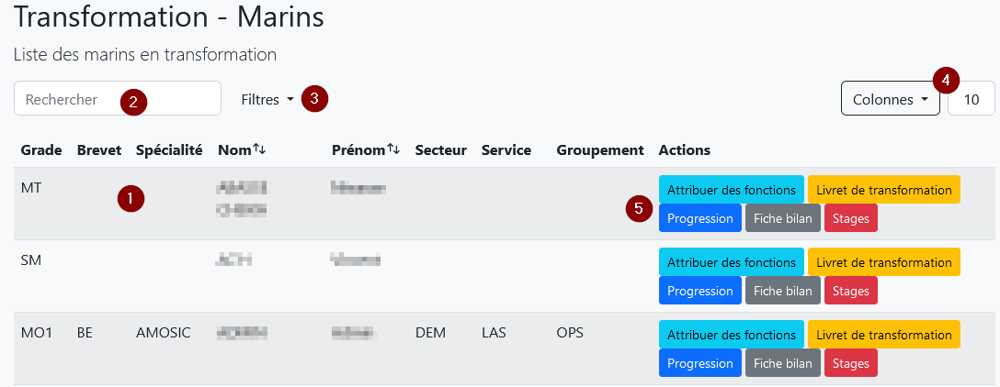

1. Vous retrouvez dans cette liste tous les marins en transformation.
2. Le filtre vous permet de n’afficher que les personnels dont le nom ou le prénom contient la chaine de caractères saisie.
3. Les filtres vous permettent d’affiner votre recherche :

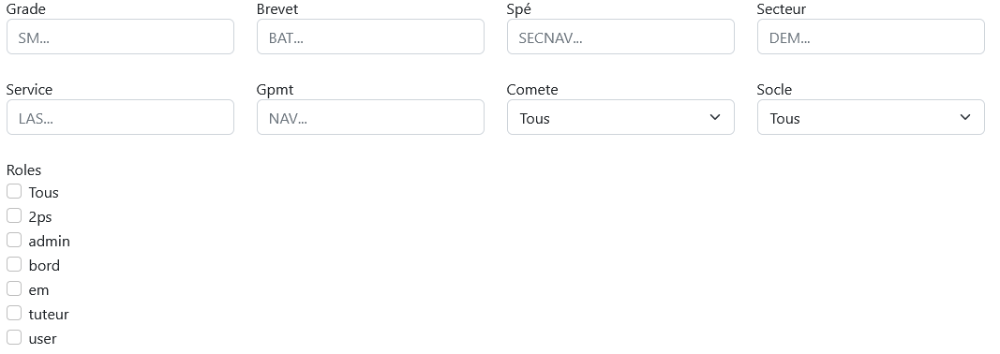

4. Vous pouvez paramétrer l’affichage : le bouton colonne vous permet de cacher/afficher les colonnes selon vos besoins et le nombre est le nombre de lignes affichées sur la page courante.
5. Ces boutons vous permettent d’accéder aux données du marin. 
> {info} Attention : selon votre profil, certains boutons peuvent ne pas être accessibles.

<a name="attribuer-des-fonctions">

### Attribuer des fonctions
Écran permettant l’attribution et le retrait de fonction à un marin.

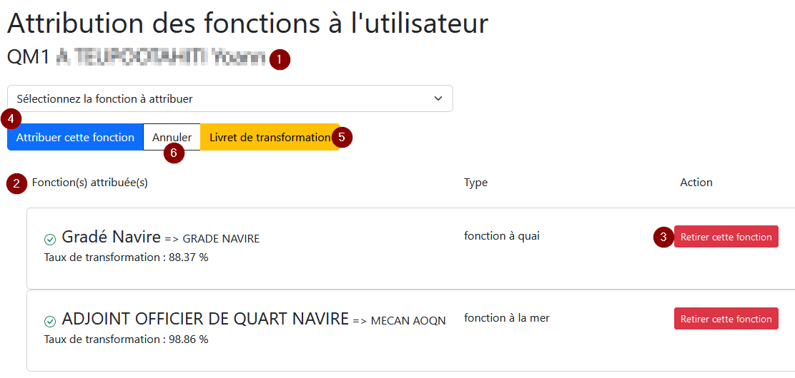

1. Identité du marin concerné
2. Liste des fonctions attribuées. 
3. Le bouton (3) « Retirer cette fonction » retire la fonction au marin.
4. Sélectionnez dans la liste déroulante la fonction à attribuer puis cliquez sur « Attribuer cette fonction » pour valider.
5. Une fois les fonctions attribuées, accédez directement au livret de transformation du marin.
6. Le bouton « Retour » permet de revenir à la liste des marins en transformation.

<a name="livret-de-transformation">

### Livret de transformation
Écran permettant la consultation et la validation des objectifs associés aux fonctions du marin.

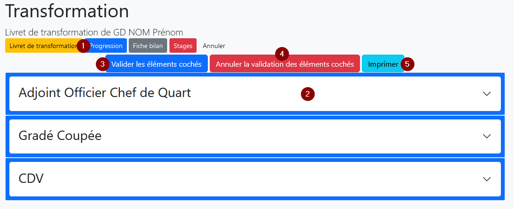

La barre de navigation (1) permet l’accès direct aux autres affichages concernant le marin sélectionné.
(2) Retrouvez la liste des fonctions du marin. Cliquez sur la ligne pour voir l’ensemble des tâches, objectifs (6), stages (7) et état de lâcher (8) associés à une fonction. 

> {info} Pour chaque fonction, les icônes suivantes signifient : 
>  - **&#10004;** le marin est lâché dans cette fonction.
>  - **&#128232;** des objectifs sont en attente de validation.

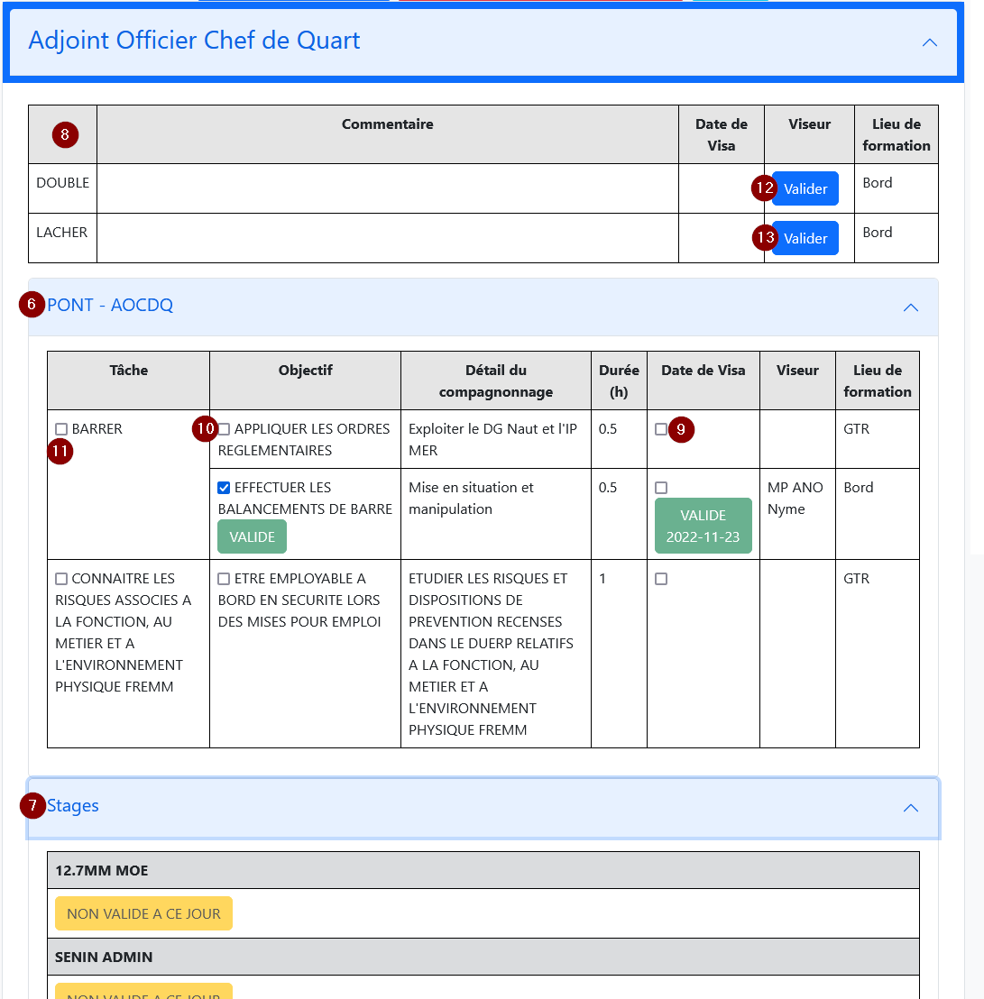

Pour valider des sous-objectifs, objectifs ou tâches (9, 10, 11), cocher la ou les case(s) à cocher adjacente(s) puis cliquer sur le bouton « Valider les éléments cochés » (3). L’écran de validation suivant s’affiche :

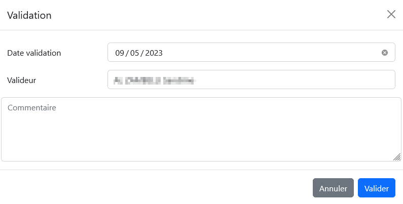

Saisir les données nécessaires. Pour enregistrer les validations, cliquer sur le bouton « Valider ».

> {info} ** Remarques: **
> - la date est par défaut la date du jour.
> - le valideur est par défaut la personne connectée.
> - le commentaire n’est pas obligatoire.

Il vous est possible d’annuler des validations en cochant les cases voulues (9, 10, 11) puis en cliquant sur « Annuler la validation des éléments cochés » (4). 
Attention, aucune confirmation de suppression n’est demandée.

Pour valider un double ou un lâcher, cliquer sur le bouton « valider » (12,13) de la ligne concernée. Le même écran de validation s'affiche. 
**Attention**, le lâcher ne peut pas être validé si le double associé ne l'est pas déjà.

Le bouton « Imprimer » (5) permet d’éditer le livret au format pdf.

**Remarque : **  Le marin concerné a la possibilité de proposer la validation d'élements du parcours. Les éléments proposés par le marin sont marqués d'une pastille "PROPOSE":

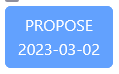

**Remarque : ** Pour imprimer au format livret, sélectionnez l’option d’impression d’Acrobate Reader « brochure ».

<a name="progression">

### Progression
Représentation graphique du taux de transformation global puis par fonction.

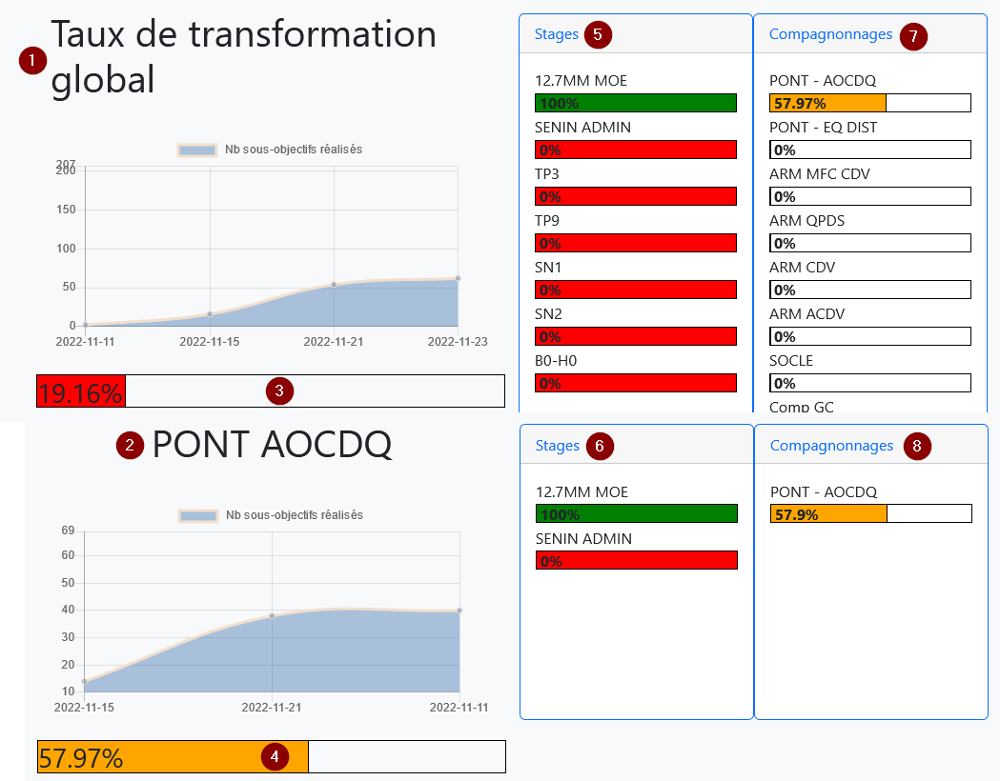

On retrouve le titre de la fonction (1) (2), le taux de transformation pour cette fonction (3) (4), la liste des stages associés (5) (6) et le taux d’avancement par compagnonnage (7) (8). 

                         Somme coefficients sous objectifs validés + nb stages validés
    Tx transfo =  100 x ---------------------------------------------------------------
                               Somme coefficients sous objectifs + nb stages

<a name="fiche-bilan">

### Fiche bilan

Récapitulatif des données de transformation pour le marin sélectionné. On retrouve sous forme de tableau, le taux d’avancement pour chaque compagnonnage et la liste des stages associés aux fonctions. Un en-tête reprécise les données personnelles.
 
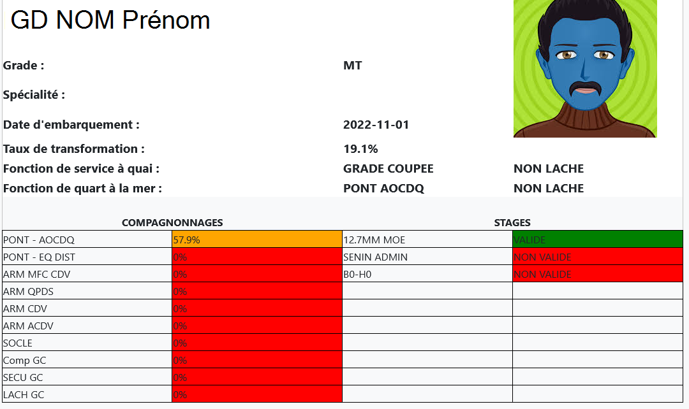

<a name="stages"> 

### Stages
Liste des stages associés aux fonctions du marin sélectionné. 

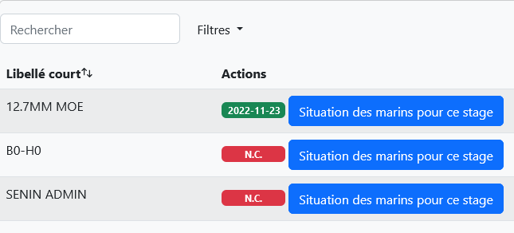

Le bouton « Situation des marins pour ce stage » vous redirige vers l’affichage de tous les marins concernés par un stage.

<a name="suivi-par-fonction">

## Suivi de la transformation par fonction
Permet de valider des objectifs ou des tâches pour plusieurs marins en même temps.

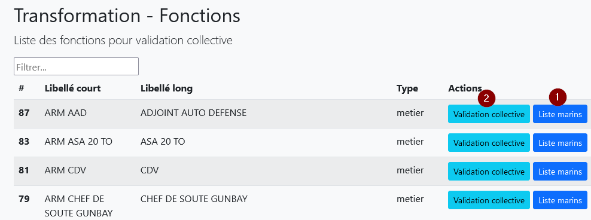

Le bouton « Liste marins » (1) affiche la liste des marins ayant cette fonction avec leur taux de transformation.
Cliquez sur le bouton « Validation collective » (2) pour afficher le tableau récapitulatif des sous-objectifs rattaché à cette fonction.

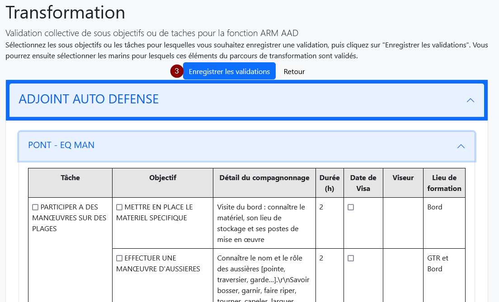

Cocher les cases à cocher correspondantes aux tâches, objectifs ou sous-objectifs à valider puis cliquer sur le bouton « Enregistrer les validations » (3). L’écran suivant s’affiche :

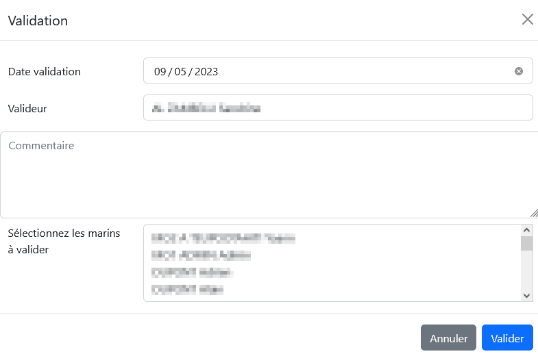

Sélectionner les marins à valider. Pour cela, cliquer sur les marins voulus en maintenant enfoncée la touche « Ctrl » de votre clavier. Cliquer ensuite sur le bouton « valider » pour enregistrer les validations. 

> {info} ** Remarques : **
> - tous les marins auront la même date, le même valideur et le même commentaire.
> - la date est par défaut la date du jour.
> - le valideur est par défaut la personne connectée.
> - Les doubles et lâchers ne peuvent pas être validés de cette façon.

<a name="suivi-par-compagnonnage">

## Suivi de la transformation par compagnonnage
Cette page permet de consulter la situation de tous les marins pour un compagnonnage.

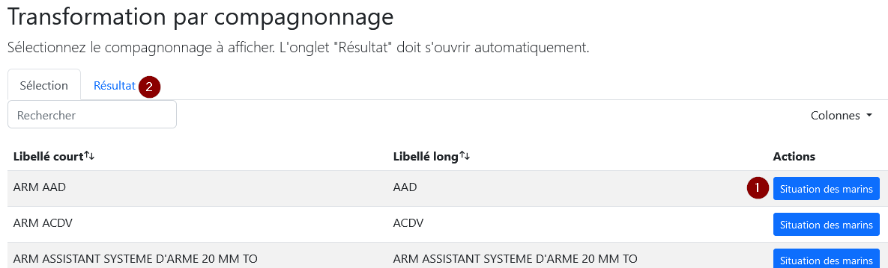

En cliquant sur le bouton « Situation des marins » (1), vous ouvrez automatiquement l'onglet "Résultat" (2). 

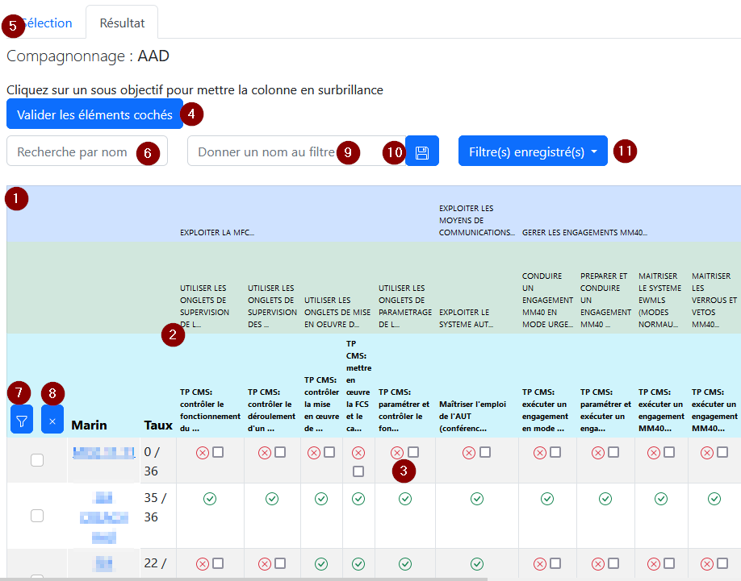

Vous y retrouvez un tableau récapitulant tous les marins (1), la liste des tache/objectifs/sous-objectifs (2), et l'état de validation pour chaque sous-objectifs (3) du compagnonnage. Vous pouvez valider la réalisation des sous objectifs en sélectionnant les cases à cocher correspondantes puis en cliquant sur " Valider les éléments cochés " (4). Un Pop-up vous permettant de saisir la date de validation, le valideur et un commantaire apparaitra.
Pour changer de compagnonnage, revenez sur l'onglet "Sélection" (5).

<a name="suivi-par-stage">

## Suivi de la transformation par stage
Cette page permet de consulter la situation des marins pour un stage.

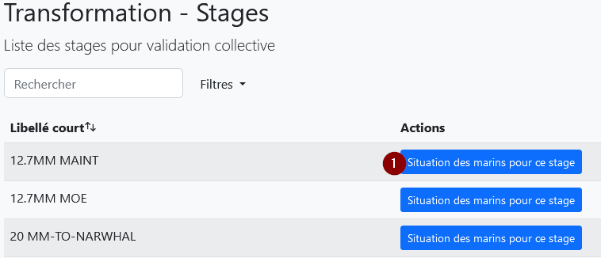

En cliquant sur le bouton « Situation des marins pour ce stage » (1), vous affichez deux listes. La première recense les marins en attente du stage ou dont le stage est périmé (2), la deuxième (3), ceux l’ayant déjà validé et dont la validité est encore en cours. En cliquant sur un nom (4), vous revenez au détail des stages du marin.

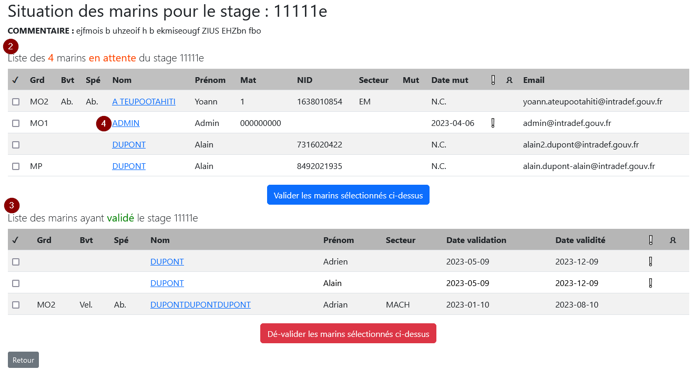
 
** Remarque : ** pour exporter ce tableau sous Excel, sélectionner toutes les cases voulues en maintenant enfoncée la touche « Ctrl » de votre clavier puis copier et coller.

<a name="recalcul-transfo">

## Recalcul des taux de transformation
Cette page permet de relancer le calcul du taux de transformation pour tous les marins non archivés. Cela peut être nécessaire lors de l'évolution des parcours (modification d'un coefficient d'un sous-objectif ou ajout d'une tâche dans une fonction par exemple). Une barre de progression vous indique l'état d'avancement.

En cliquant sur le bouton « Lancer le calcul » (1), tous les taux de transformation de tous les marins sont recalculés.

> {info} ** Remarque : ** Plus il y a de marins plus le calcul peut être long. 

<a name="parcours-fiche-bilan">

# Parcours des fiches bilan
Ce menu va vous permettre de consulter toutes les fiches bilan en fonction des critères sélectionnés. Vous devez saisir au moins 1 critère pour pouvoir afficher les fiches.

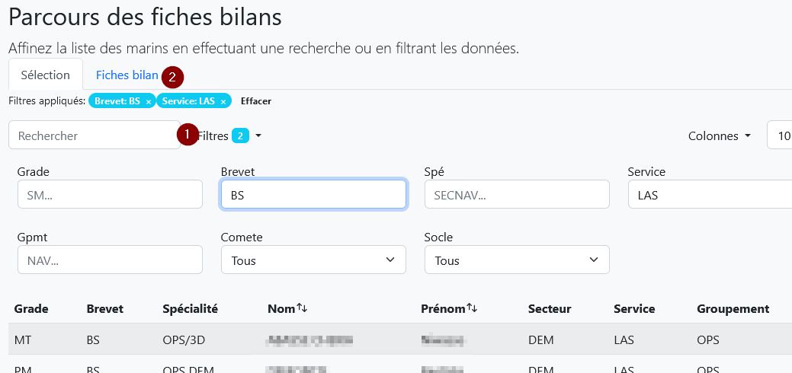

Saisissez les critères de filtre (1) dans l'onglet "Sélection" et consulter les fiches associées dans l'onglet "Fiches bilan" (2).

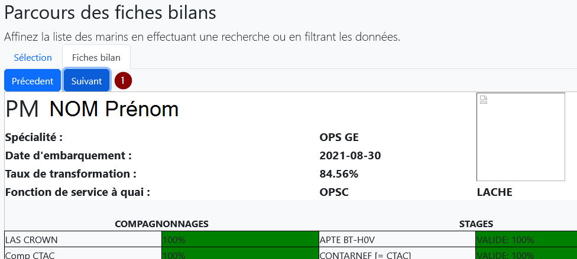

Naviguez entre les fiches avec les boutons "Précédent et Suivant" (1). Vous pouvez revenir sur l'onglet "Sélection" pour modifier vos critères.

<a name="ma-transformation">

# Ma Transformation
Ce menu n’est visible que pour les marins qui ont une fonction attribuée. 
Il y retrouve sur le même modèle que dans le menu « Transformation » :
- son propre livret de transformation,
- ses diagrammes de progression,
- sa fiche bilan.

Dans le livret de transformation, le marin peut sélectionner les éléments du parcours dont il veut proposer la validation à ses tuteurs.
La sélection et la validation se font sur les mêmes écrans détaillés ci-dessus.
Lorsqu'un marin propose la validation d'un élément du parcours, cet élément est associé à une pastile "PROPOSE" associée à la date de proposition.

Le marin peut renseigner un commentaire qui est accessible sur l'élément considéré en laissant la souris sur la pastille.

Dans le livret de transformation, les tuteurs sont libres de valider ou de refuser les propositions faites par le marin.
