# Administration

- [Menu Administration](#menu_administration)
- [Demandes Mindef Connect](#demandes-mindef-connect)
- [Fiches des marins](#fiches-des-marins)
- [Rôles](#roles)
- [Droits d'accès](#permissions)
- [Liens](#liens)
- [Historique](#historique)
- [Annudef](#annudef)
- [Archivage](#archivage)
- [Mails](#mails)

## Menu Administration

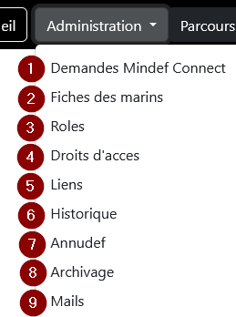

Ce menu permet d’accéder : 
 
1. Liste des demandes de connexion en attente de validation.
2. Liste des marins.
3. Liste des rôles.
4. Liste des autorisations possibles sur l’application.
5. Gestion des liens disponibles sur la page d’accueil des marins uniquement en transformation.
6. Historique des actions concernant la transformation.
7. Recherche des marins grâce à l’annuaire défense.
8. Liste des marins archivables.
9. Rédaction de mail.

## Demandes Mindef Connect
Lorsqu’un utilisateur inconnu essaye de se connecter la première fois, il reçoit ce message : « Demande enregistrée. Votre compte doit être validé par un administrateur. Veuillez réessayer ultérieurement. ». Cela signifie que tant que l’administrateur n’a pas validé la demande par le biais de ce menu, l’utilisateur n’aura pas accès à l’application.

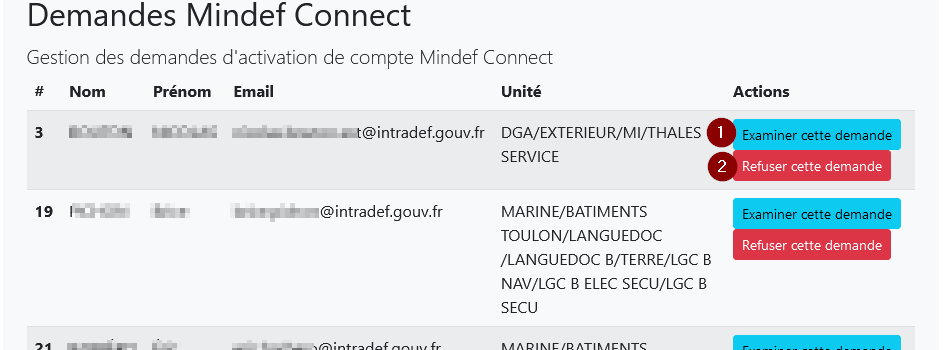

L’administrateur peut refuser d’inscrire le demandeur en cliquant sur le bouton « Refuser cette demande » (2). Si la demande est justifiée, il clique sur « examiner cette demande » (1). 
La fiche utilisateur est alors affichée :

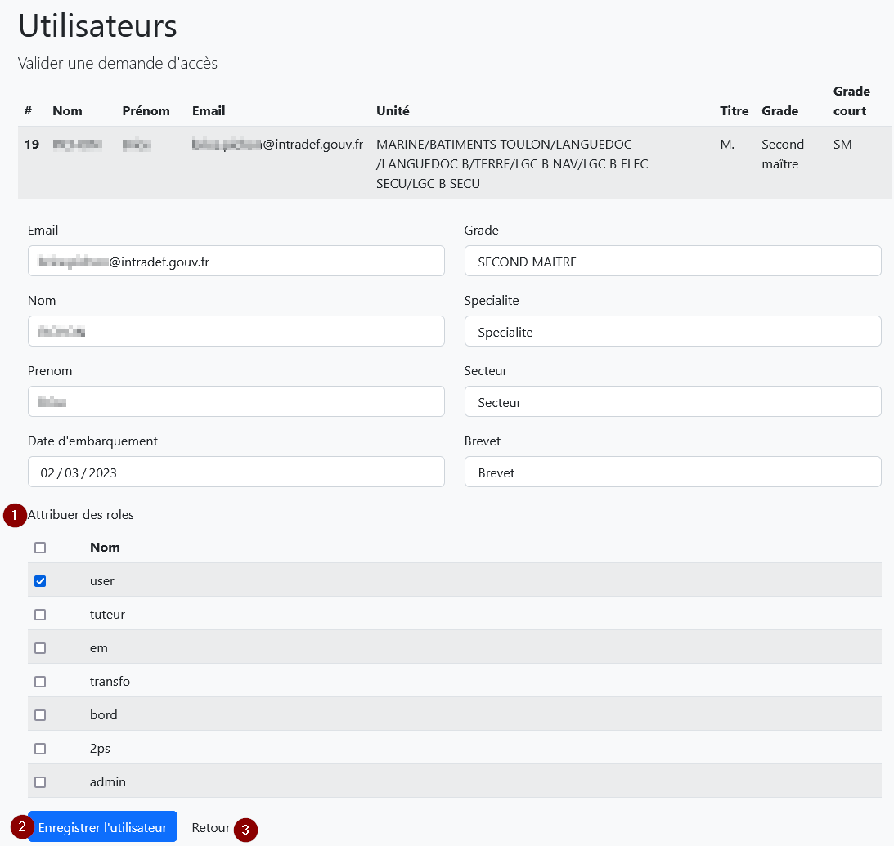

Certains champs sont pré-remplis mais modifiables. Les autres pourront être complétés plus tard si besoin. 

Dans la partie « Attribuer des rôle »:
(1), sélectionnez le(s) rôle(s) du marin. Enregistrez les données en cliquant sur le bouton (2) "Enregistrer l’utilisateur".
Le bouton « retour » (3) permet de revenir à la liste des demandes d’activation de compte.

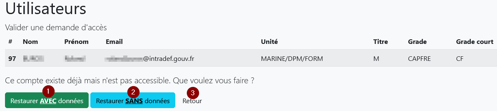

Si le demandeur est en cours d'archivage (supprimé des affichages mais pas de la BDD), il est possible de rouvrir son compte soit en conservant (1) les données déjà associées (transformation et données personnelles) soit en les supprimant (2).
Le bouton « retour » (3) permet de revenir à la liste des demandes d’activation de compte.

## Fiches des marins
Vous retrouvez la liste de tous les marins ayant le droit de se connecter à l’application (1) classés par ordre alphabétique. Des filtres (2) (3) vous permettent d’affiner l’affichage. 

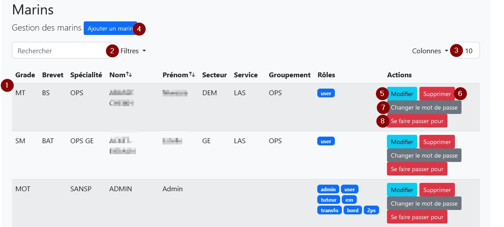

(4) « Ajouter un marin » pour créer un nouveau compte.  
(5) « Modifier » les données du marin.  
(6) « Supprimer » le marin.  

** Remarque : ** La suppression ne supprime pas le marin de la BDD mais il n’est plus visible dans les listes. Le compte ne peut plus être créé à nouveau. Pour rendre visible ce marin, allez "Restaurer" le marin dans le menu Archivage.

(7) « Changer le mot de passe » valable uniquement pour les marins qui n’utilisent pas la connexion Mindef Connect.  
(8) « Se faire passer pour » permet de prendre la place du marin sélectionné. Une fois connecté avec le profil de cet utilisateur, cliquez sur le bouton "Redevenir soi-même" pour quitter ce profil.

## Rôles
À partir de cet écran, vous pouvez gérer les rôles. 

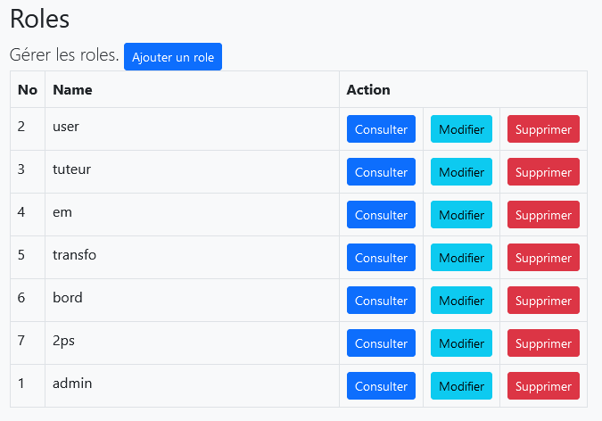

Un rôle regroupe l’ensemble des permissions (ou autorisations ou droits d’accès) qu’aura un utilisateur sur l’application. 

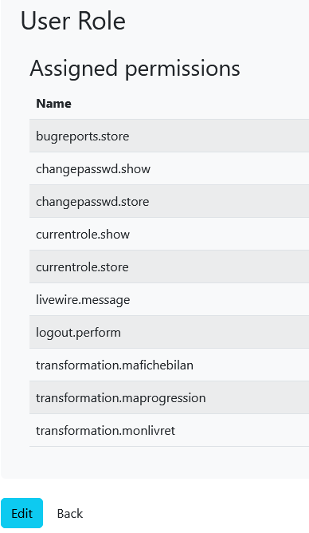

## Droits d’accès
À partir de cet écran, vous pouvez gérer les permissions c’est à dire les actions possibles sur l’application.

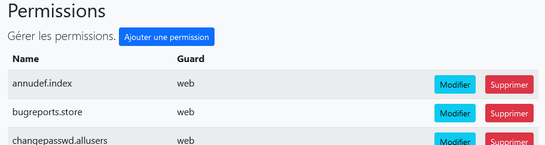

> {info} Remarques : 
> - Si vous ajoutez une permission, n’oubliez pas de l’associer au rôle qui doit pouvoir effectuer l’action liée.
> - L'association d'une permission à une fonctionnalité du logiciel relève de l'équipe de développement logiciel.

## Liens
Cet écran permet de gérer l’affichage des liens liés à la transformation qui apparaissent sur la page d’accueil des marins en transformation.

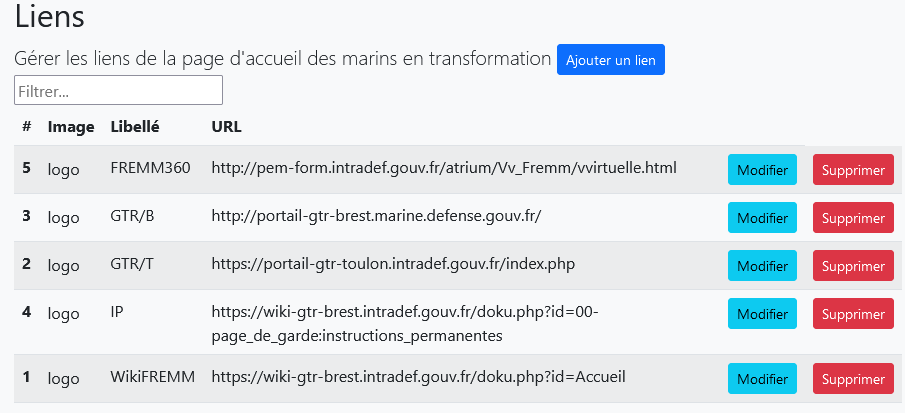

Voici le résultat sur la page d’accueil :

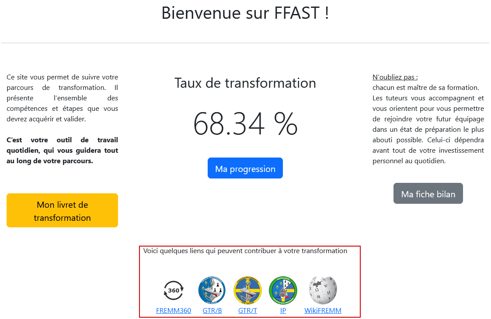

## Historique
Écran qui liste toutes les actions liées à la transformation.

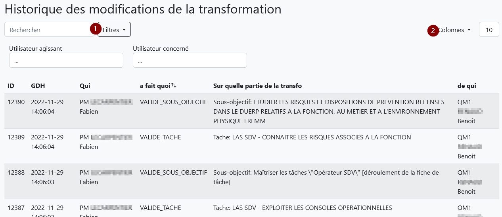

Des filtres (1) (2)  permettent d’affiner l’affichage. 

## Annudef

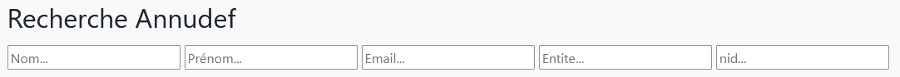

Cet écran permet de pré-remplir la fiche du marin que vous souhaitez intégrer à l’application avant qu’il n’en fasse la demande par le biais de Mindef Connect.
Saisissez vos critères de recherche (1), puis cliquez sur « Créer la fiche » (2).

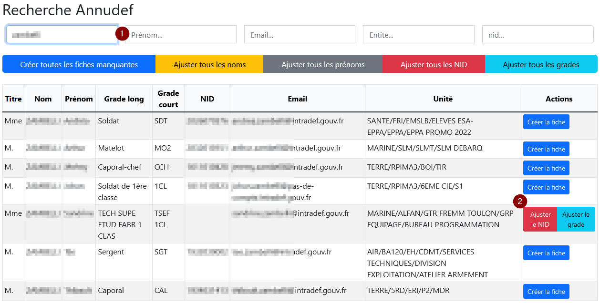

Pour compléter ou modifier la fiche du marin, retournez dans le menu correspondant.

En outre, cette page permet de corriger les données des fiches des utilisateurs pour les aligner avec les données Annudef.

Pour cela:
- rechercher l'utilisateur (ou un groupe d'utilisateurs par exemple en utilisant la recherche par entité).
- aligner les données, soit fiche par fiche, soit en masse grâce aux boutons en tête de liste.

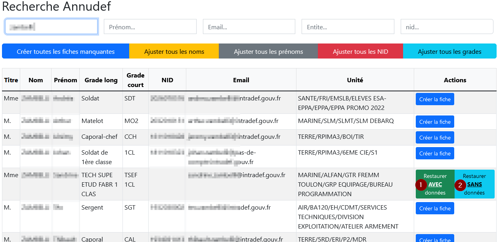

Si le marin est en cours d'archivage (supprimé des affichages mais pas de la BDD), il est possible de recréer sa fiche soit en conservant (1) les données déjà associées (transformation et données personnelles) soit en les supprimant (2).

## Archivage
Cet écran va permettre d'archiver les marins. Vous y retrouvez les marins supprimés dans le menu "Fiches des marins".

Le bouton "Restaurer AVEC données" (1) permet de recréer la fiche du marin en conservant toutes les données liées à sa transformation. Le bouton "Restaurer SANS données" (2) permet de recréer la fiche du marin en supprimant toutes les données liées à sa transformation.
Le bouton "Télécharger livret" (3) permet d'obtenir le livret du marin au format pdf pour une sauvegarde en local.
Le bouton "Archivage" (4) supprime le marin de l'application. Son PPA est sauvegardé sur le serveur et ses données enregistrées pour établir des statistiques. Il faudra restaurer son compte avec les menus annudef ou mindefconnect si vous voulez le faire réapparaitre dans vos listes.

## Mails

Ce menu, réservé à l'administrateur de l'application, permet d'envoyer des mails (format markdown) aux utilisateurs de l'application.