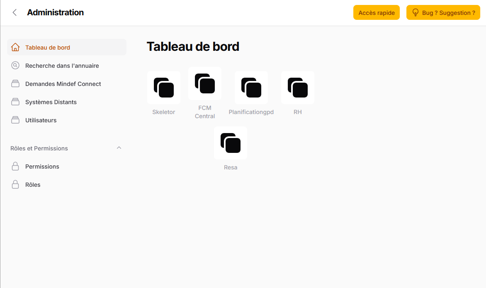
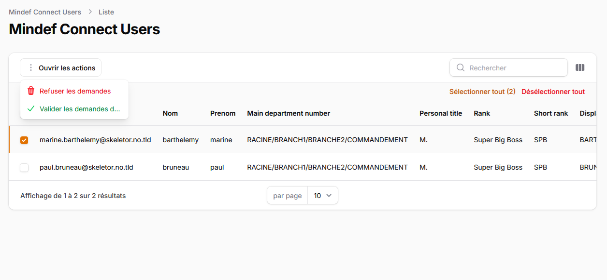
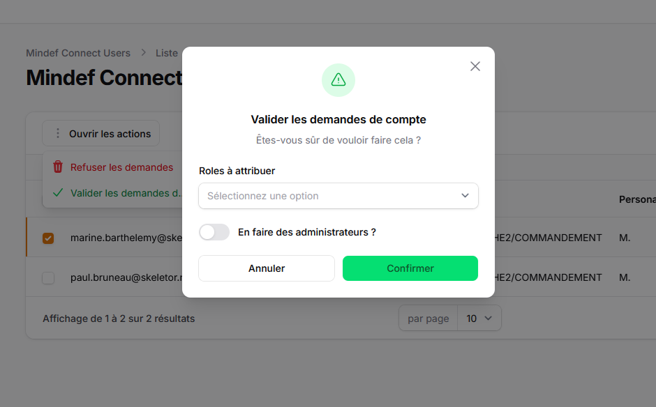
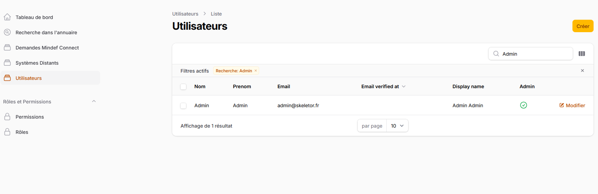
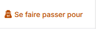
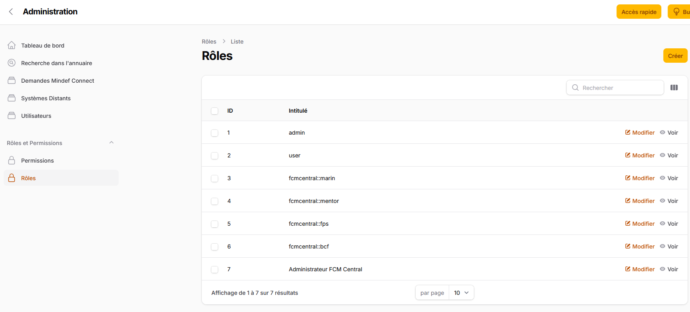
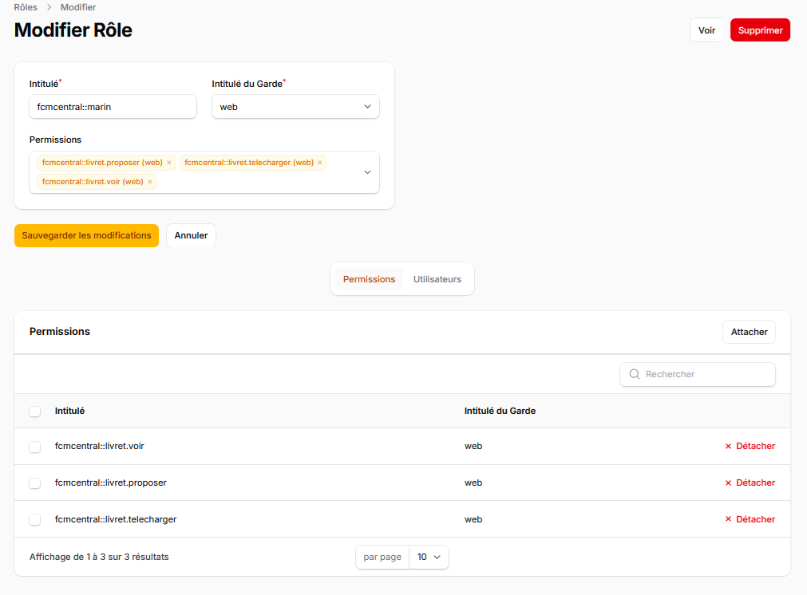
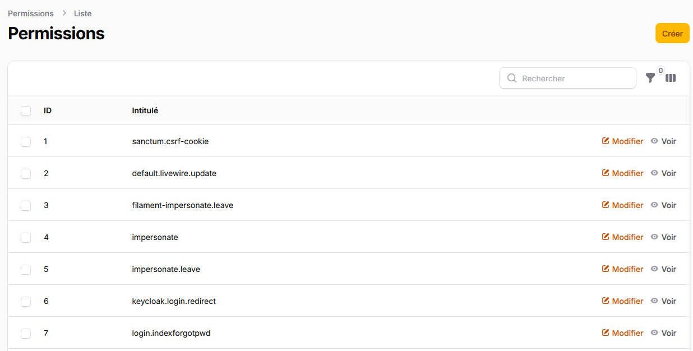
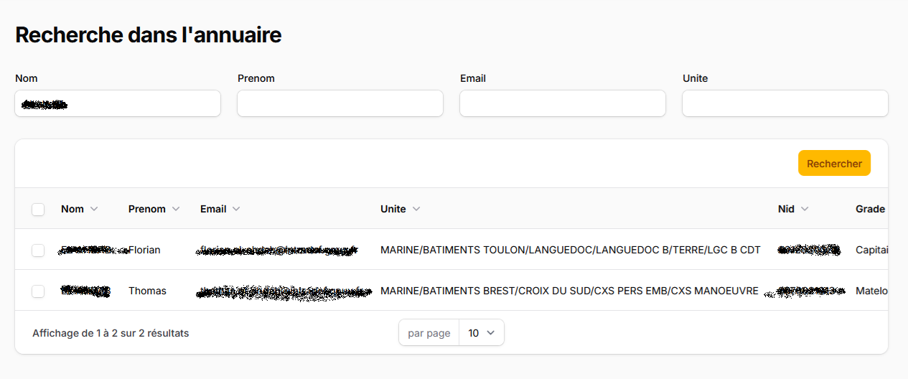
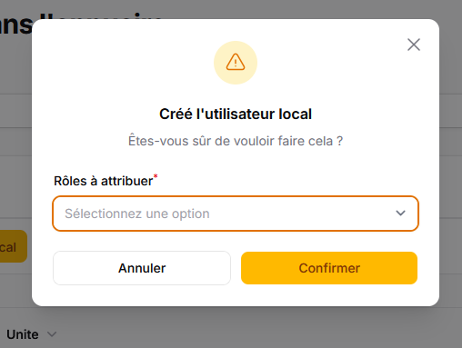

# Administration

## Panneau d'administration

Tout serveur POSEIDON est construit sur Skeletor. Donc tout serveur POSEIDON dispose du panneau d'administration représenté ci-dessus.

Ce panneau rassemble les fonctions d'administration de base du serveur POSEIDON:
 
1. Une fonction de recherche dans Annudef intégrée pour faciliter la création des comptes utilisateurs
2. Liste des demandes de connexion en attente de validation (voir [Connexion](../connexion/) pour plus de détails sur les modalités de connexion au serveur et à la possibilité de configurer le serveur pour la validation automatique des connexions avec Mindef Connect)
3. La page de gestion des systèmes distants
4. La page de gestion des utilisateurs
5. La page de gestion des permissions
6. La page de gestion des rôles

## Demandes Mindef Connect

Lorsqu’un utilisateur inconnu essaye de se connecter pour la première fois en utilisant Mindef Connect, et que le serveur est configuré pour exiger une validation par un administrateur, l'utilisateur reçoit ce message : « Demande enregistrée. Votre compte doit être validé par un administrateur. Veuillez réessayer ultérieurement». 

Dans le panneau d'administration, les utilisateurs disposant des permissions requises peuvent consulter la liste des demandes de création de compte en attente:

L’administrateur peut alors sélectionner une ou plusieurs demandes en attente, et cliquer sur « Refuser les demandes » ou sur "Valider les demandes".

Lorsqu'il décide de valider, l'application demande quels rôles doivent être attribués à l'utilisateur.

!!! note "Pas de panique"

    Vous êtes administrateur et vous ne savez pas quel rôle attribuer à l'utilisateur ?

    Pas de panique, cette décision est toujours réversible et vous pourrez modifier la liste des rôles attribués à l'utilisateur ultérieurement.

## Comptes utilisateur
Vous retrouvez dans cette page liste de tous les comptes utilisateur de ce serveur POSEIDON.

Il est possible de cliquer sur le bouton "Modifier" en bout de ligne à droite pour accéder à la fiche de l'utilisateur et la modifier si nécessaire.

Il est également possible de créér un utilisateur manuellement en cliquant sur le bouton "Créér".

Skeletor offre une fonctionnalité très puissante permettant à l'administrateur de se connecter en utilisant le compte utilisateur de quelqu'un d'autre. Pour utiliser cette fonction, l'administrateur doit cliquer sur le bouton  en bout de page.

!!! warning "Attention, fonction très puissante"

    Cette fonction est très puissante. Elle s'accompagne donc de mesures de sécurité particulières: 

    Toute les actions réalisées par l'utilisateur se faisant passer pour quelqu'un d'autre sont journalisées de façon spécifique, afin de bien savoir qui a réellement fait quoi dans l'application.

    Cette fonction permet notamment à l'administrateur de régler les problèmes de permissions que les utilisateurs sont susceptibles de rencontrer.

!!! note "Super administrateur"

    Dans Skeletor, un utilisateur dispose de permissions (voir ci-dessous). Mais certains utilisateurs peuvent se voir attribuer la qualité d'Administrateur du serveur. Lorsqu'un utilisateur est Administrateur du serveur, c'est comme s'il avait toutes les permissions.
    On désignera ces utilisateurs sous le terme de "Super-Administrateur" dans la documentation.

## Rôles
À partir de cet écran, vous pouvez gérer les rôles. 

Un rôle regroupe l’ensemble des permissions (ou autorisations ou droits d’accès) qu’aura un utilisateur dans l’application. 

!!! note "Les modules métier définissent leur propres permissions"

   Skeletor définit déjà des permissions (par exemple pour pouvoir gérer les utilisateurs, ou définir les rôles, etc..) mais la plupart des permissions présentes dans les listes présentées dans cette page sont définies par les modules métiers eux-mêmes, en fonction des besoin de contrôle d'accès.

## Permissions

La page de gestion des permissions n'est accessible qu'aux "Super administrateurs" (voir comptes utilisateurs ci-dessus)

!!! warning "Ne pas faire de modification sur les permissions"

    Vous êtes super administrateur de votre serveur: ne faites aucune modification sur les permissions du serveur manuellement.

    En effet, l'association d'une permission à une fonctionnalité du logiciel relève de l'équipe de développement logiciel. Si vous renommez une permissions, vous cassez ce lien. Si vous supprimez une permission, c'est comme si plus aucun utilisateur n'en disposait. Et si vous créez une permission, elle ne servira à rien puisqu'aucun module métier ne s'en service.

## Recherche dans l'annuaire

Saisissez vos critères de recherche, puis cliquez sur « Rechercher ».

Vous pouvez ensuite cliquer sur le bouton "Créer l'utilisateur local" en bout de ligne à droite, ou bien sélectionner plusieurs lignes et utiliser l'action groupée "Crée l'utilisateur local" qui apparait en entête de la liste pour créér un ou plusieurs comptes utilisateurs avec ces résultats de recherche.

Dans les 2 cas, vous devrez sélectionner les rôles à attribuer à ces nouveaux utilisateurs.

