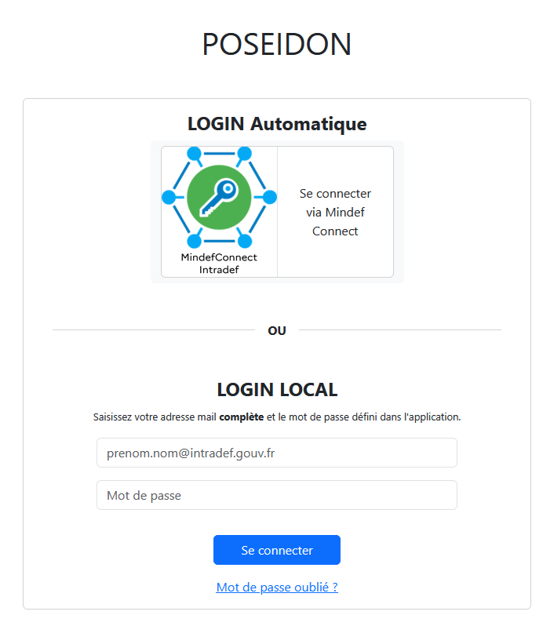
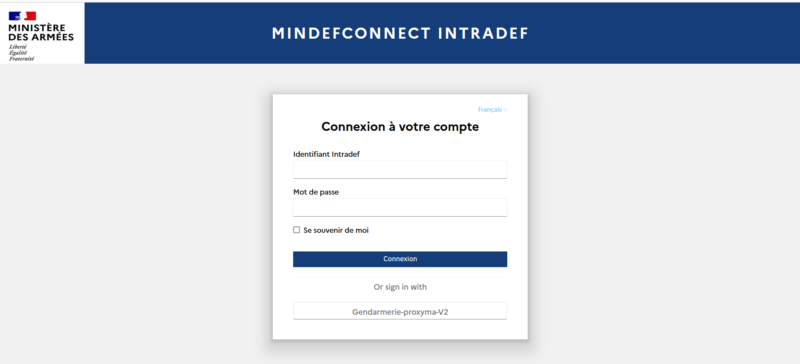
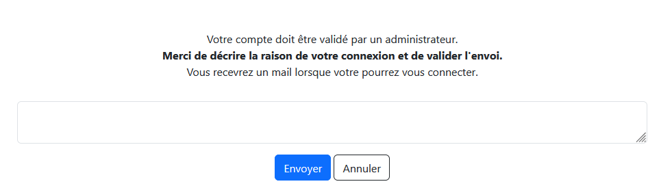
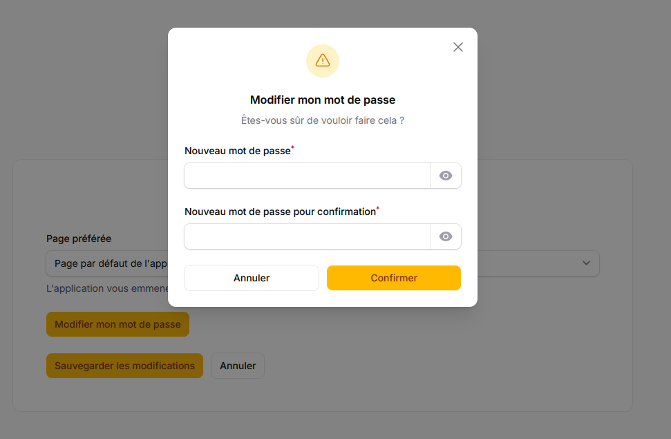
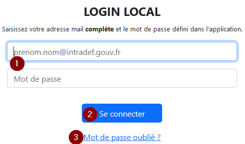
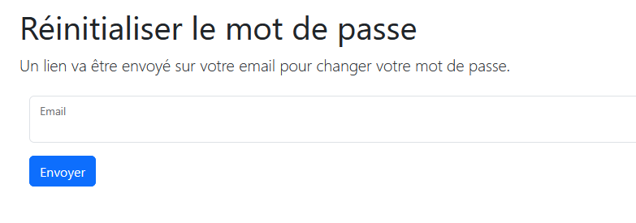
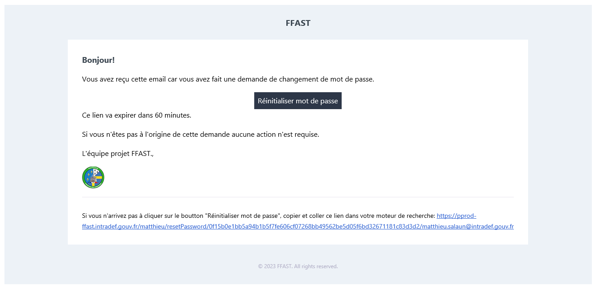

# Connexion

## Généralités

Pour accéder à un serveur POSEIDON, l’utilisateur doit avoir accès à un ordinateur ayant accès à **Intradef**. 

Après avoir cliqué sur le bouton "login" de la page d'accueil du site, deux types de connexion sont disponibles :

  1. L'authentification MindefConnect (également appelée "Login automatique") qui permet de se connecter avec ses identifiants DR-CPT.
  2. Le login "local" qui permet de se connecter avec son adresse email et un mot de passe défini par l'utilisateur.

  

!!! warning "Le lien mot de passe oublié permet de réinitialiser son mot de passe local."

    Pour cela, il faut tout de même avoir déjà un compte créé sur le serveur concerné. Après avoir cliqué sur le lien, l'utilisateur doit rentrer son adresse email. S'il dispose effectivement d'un compte sur le serveur POSEIDON concerné, il reçoit un mail sur son adresse, avec un lien temporaire lui permettant de redéfinir son mot de passe local.

!!! note "Remarque"

    Que la connexion soit établie avec le login local ou MindefConnect, dans les deux cas, vous travaillerez sur la même application. Il n'y a pas de travail "local" possible.

## Authentification MindefConnect (Login automatique)

En cliquant sur LOGIN AUTO, si les services du socle CND sont tous fonctionnels, il vous sera proposé  de vous connecter en entrant un identifiant et un mot de passe.

Entrez votre l’identifiant DR-CTP (en général premier lettre du prénom.nom – ex : p.nom) et votre mot de passe : 

  - pour les **marins** à terre (disposant d'une station Intradef normale), il s’agit du mot de passe de la session windows.
  - pour le **bord**, il s’agit du mot de passe associé au compte DR-CPT.

Lors de la première connexion, vous pouvez rencontrer les 2 situations suivantes:

- soit le serveur sur lequel vous vous connectez est configuré pour accepter les nouveaux utilisateurs automatiquement: dans ce cas, votre compte sera automatiquement créé, un rôle (ensemble de permissions) vous sera attribué, et vous serez redirigé vers la page par défaut du serveur en question.
- soit il il vous sera demandé de saisir la raison de votre demande d'accès à l'application. Un administrateur devra ensuite valider la création de votre compte, et vous attribuer un role ou des permissions. Un mail confirmant votre autorisation d'accès vous sera envoyé dès que votre compte sera actif.

!!! note "Remarque"

    Si l’utilisateur ne connait pas son mot de passe DR-CPT, il doit contacter les SIC de proximité pour faire réinitialiser son mot de passe. Cette procédure est la procédure normale de DR-CPT et n'a rien à voir avec POSEIDON.

    D’une façon générale, le mot de passe peut-être réinitialisé par le CORSIC de l’unité d’affectation Annudef, en utilisant le site https://portail-motdepasse.intradef.gouv.fr/

## Login Local

### Principe général

Pour pallier une éventuelle indisponibilités du service Mindef Connect, il est aussi possible de se connecter avec des identifiants dits "locaux".

### Définir son mot de passe local

Pour cela, vous devez définir votre mot de passe local en passant par le menu qui s'ouvre lorsque vous cliquer sur votre photo Annudef (ou le petit profil anonyme si vous n'avez pas de photo Annudef ou que le site n'a pas réussi à la charger) située en haut, à droite de l'écran, puis en sélectionnant "Mes préférences".

Votre mot de passe local doit comporter au moins 8 caractères.

Dans le cas ou l'authentification MindefConnect n'est pas possible, vous saisissez votre adresse mail intradef complète et le mot de passe choisi 

### En cas d'oublie: réinitialisation du mot de passe local

En cas d'oubli de votre mot de passe local, cliquez sur le lien "Mot de passe oublié ?"

Saisissez votre adresse mail intradef complète et validez. Un lien permettant de réinitialiser votre mot de passe vous est envoyé sur votre messagerie.

Dans le mail reçu, cliquez sur le bouton "Réinitialiser mot de passe".

Saisissez deux fois votre nouveau mot de passe (minimum 8 caractères)!

### Si ça ne marche toujours pas

Si la réinitialisation du mot de passe DR-CPT n’est pas possible ou ne peut pas être faite, et que vous n'avez pas initialisé vos identifiants locaux, il faut l’intervention d’un administrateur du serveur POSEIDON. Vous pouvez envoyer un mail à l’adresse: ffast.notification.tec@intradef.gouv.fr.
