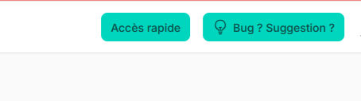

# Développement

<a name="generalites"></a>

## Généralités

Skeletor est le squelette d'application Web Intradef mis à la disposition des développeurs de la FAN par le FANLab.  

Ce squelette a notamment pour objectif de placer le développeur dans un environnement lui permettant de développer ses idées sans avoir à réinventer la roue.  

Ainsi, les tâches normalement réalisées au tout début d'un projet ont déjà été réalisées, et le développeur n'a pas à s'en préoccuper.  

Skeletor tire partie de l'expérience acquise sur le projet FFAST du GTR Toulon, et inclut donc des briques fonctionnelles requises ou utiles pour l'intégration dans Intradef (Mindef Connect en particulier, mais aussi envoi de mail Intradef et interrogation de l'Annudef), basées sur des technologies conformes au CCT afin de faciliter, le cas échéant, la validation du projet par la comitologie ministérielle.  

Skeletor est basé sur la stack TALL (Tailwind, Alpine JS, Laravel, Livewire) complétée par Filament. Destiné à être mis en oeuvre sur la plateforme de développement du FANLab, ce squelette d'application doit aussi composer avec quelques contraintes techniques inhabituelles qui sont décrites ci-dessous et que le développeur devra respecter s'il veut que son application fonctionne.
A l'usage, ces contraintes ne sont pas difficiles à intégrer et ne posent pas de grosse difficulté. Dans Skeletor, le plus gros du travail est déjà fait.  


!!! note "Lire la documentation"
    Cette documentation ne reprend pas la documentation des briques techniques utilisées. Pour parfaitement la comprendre, il est préférable que le développeur se soit déjà intéressé à la documentation des composants techniques suivants:
    
    - [le framework Laravel](https://laravel.com/docs/12.x)
    -  [le framework Filament](https://filamentphp.com/docs/4.x)
    
    Les informations ci-dessous viennent préciser comment cet ensemble est mis en oeuvre dans le cadre particulier de la plateforme de développement du FANLab.

## Distinguer ce qui relève du spécifique de ce qui relève du générique

L'un des objectifs de Skeletor et de la plateforme de développement du FANLab, c'est de permettre la collaboration sur le développement des outils de la FAN.  

Par conséquent, lorsqu'un développeur envisage de rajouter une fonctionnalité à son application et/ou son module, il doit se demander s'il s'agit d'un besoin métier spécifique, ou d'un besoin générique pouvant potentiellement servir à d'autres.  

- S'il s'agit d'un besoin métier spécifique, le développeur peut l'inclure dans son module.
- S'il s'agit d'un besoin potentiellement générique, le développeur doit se poser la question d'en faire un composant générique inclus dans Skeletor pour tout le monde. Dans ce dernier cas, une coordination avec les équipes du FANLab est nécessaire car ces dernières doivent pouvoir assurer la compatibilité ascendante avec les applications déjà en production.

<a name="nwidart-modules"></a>

## Développement modulaire

Skeletor inclue les packages ```nwidart/laravel-modules``` et ```mhmiton/laravel-modules-livewire``` qui facilitent le développement d'application Laravel sous forme de modules.

Le recours à ces outils, s'il n'est pas indispensable pour un maquétage ou une application temporaire, doit être envisagé dès lors que le développement présente un intérêt manifeste de généralisation. La modularisation des applications permet d'envisager leur intégration dans une même application chapeau. C'est l'un des buts de Skeletor. Lors du lancement du développement d'un nouveau module, les équipes du FANLAB feront le nécessaire pour générer un module pour le développeur.  

Le dévelopement modulaire présente quelques complications supplémentaires:
- les modules ne doivent pas dépendre les uns des autres, ou les dépendances doivent être gérées;
- les modules ne doivent pas entrer en conflit sur les noms de routes, de permissions, de rôles, de tables en base de données, etc...

!!! note "Conversion d'une application en module"
    
    Il est toujours possible de convertir une application, même complexe, en module. Néanmoins, plus on s'inscrit dans la démarche de modularisation tôt, plus la démarche est simple à mettre en oeuvre.

<a name="modules-tables"></a>

### Préfixe des tables en base de données

Afin d'éviter que 2 modules utilisent le même nom de table en base de données, il est indispensable de préfixer les noms de tables. Or, dans Laravel/Eloquent, le nom de la table est normalement dérivé du nom du Modèle. Il faut donc contrarier ce fonctionnement par défaut pour parvenir à préfixer les noms des tables.

Pour faciliter la mise en place de ce préfixe, Skeletor inclue le Trait ```HasTablePrefix```.

Au niveau de chaque module, ce Trait doit être surclassé de la façon suivante:

```php
<?php

namespace Modules\Transformation\Traits;

use App\Traits\HasTablePrefix as BasePrefixTrait;

trait HasTablePrefix
{
    use BasePrefixTrait;

    protected $prefix = 'transformation_';
}
```

Chaque modèle du module peut alors simplement ```use HasTablePrefix``` pour rajouter le même préfixe à tous les modèles du module.  

Evidemment, le préfixe doit être pris en compte dans les migrations et éventuellement les seeders du module.
Une fois mis en place, les requêtes Eloquent sur les modèles préfixés se passent normalement.

!!! note "Relations Many To Many"
    Dans Laravel, le nom des tables pivot utilisées dans les relations ManyToMany sont par défaut dérivées automatiquement depuis le nom des modèles Eloquent qui sont mis en relation. Evidemment, ce mécanisme ne prend pas en compte le besoin de préfixe que le développement modulaire impose. Par conséquent, le développeur devra penser à présicer le nom des tables pivot que les relations ManyToMany doivent utiliser.

<a name="modules-routes"></a>

### Préfixe des routes du module

!!! note "Routes" 
    
    Afin de bien séparer fonctionnellement les modules les uns des autres, les routes déclarées par chaque module doivent également être préfixées. Par défaut, le service provider qui déclare les routes du module est ajusté pour préfixer les routes de chaque module comme il convient.

<a name="modules-resources"></a>

### Nom des vues, des composants Blade et des composants Livewire

Les vues, composants Blade et composants Livewire sont eux aussi préfixés avec ```nom_du_module::```

!!! note "Création de composants Livewire dans les modules"
    Le package  ```mhmiton/laravel-modules-livewire``` introduit la commande artisan ```module:make-livewire``` qui facilite la création d'un composant livewire au sein d'un module.

<a name="modules-navbar"></a>

### Utilisation de la barre de menus de Skeletor

Afin d'offrir une expérience de navigation agréable aux utilisateurs, les modules peuvent déclarer à Skeletor des pages
à faire apparaitre dans le menu "Accès rapide" des panneaux Filament.  



Cette fonctionnalité ne nécessite pas pour cela que le module lui-même inclue un panneau Filament.
Si le module expose lui-même un panneau Filament, ce panneau verra la fonctionnalité "Accès rapide" automatiquement intégrée, avec les pages déclarées par tous les modules faisant usage de cette fonctionnalité.  

Cette fonctionnalité repose sur les "render hook" de Filament. Voir dans AppServiceProvider.php.  

Pour déclarer ses pages à accès rapide, le module doit utiliser les fonctions de ```ModuleDefinedMenusRegistry```. Ce registre permet aux modules de déclarer des liens d'accès rapides qui peuvent contenir des sous liens.  

Voici l'exemple du liens d'accès rapide déclaré par Skeletor lui-même pour que les utilisateurs puissent revenir vers le panneau Filament d'administration depuis les autres panneaux Filament déclarés dans les modules.  

```php
<?php

app(ModuleDefinedMenusRegistry::class)->registerDirectMenuItems([
    DirectMenuItem::make()
        ->name('Administration')
        ->visible(fn() => auth()->check() )
        ->children([
            DirectMenuItem::make()
                ->name('Panneau d\'administration')
                ->url(fn() => Dashboard::getUrl(panel: "admin"))
                ->visible(fn() => auth()->check() && Dashboard::canAccess()),
            
        ]),
    ]);
```

Les ```DirectMenuItem``` permettent de définir les liens d'accès direct caractérisés par leur nom (name), une url et une visibilité. Les url et visibilité peuvent être définis par des valeur simples ou par des Closure qui seront évaluées au moment d'afficher le lien d'accès direct dans les panneaux Filament.  

Le paramètre visible détermine évidemment si le lien d'accès direct en question est visible. Il permet notamment de cacher les liens vers lesquels l'utilisateur n'a pas le droit d'aller (en utilisant une Closure pour faire cette évaluation à la volée).  

Dans l'exemple ci-dessus, le lien vers le panneau d'administration ne sera visible dans le menu que si l'utilisateur est connecté. Un utilisateur anonyme ne verra pas le lien.  

<a name="modules-pages-preferees"></a>

### Déclaration des pages préférées de l'utilisateur

Skeletor permet à l'utilisateur de préciser vers quelle page il souhaite être redirigé par défaut lorsqu'il ouvre sa session.  

Les modules peuvent déclarer des pages que l'utilisateur peut choisir comme page préférée.  

Une fois les pages déclarées, l'utilisateur peut les voir apparaitre dans la liste des pages préférées qu'il peut trouver sur la page "Mes préférences" à laquelle il accède depuis son menu personnel (en haut à droit, sous son avatar le cas échéant).  

Pour déclarer des pages à proposer à l'utilisateur dans ce menu, il faut utiliser les fonctionnalités de ```ModuleDefinedPreferedPagesRegistry```.  

Voici un exemple de déclaration de page préférées possibles:
```php
<?php

app(ModuleDefinedPreferedPagesRegistry::class)->registerPreferedPagesItems(
    [
    PreferedPageItem::make()
        ->name('FCM central: liste des marins')
        ->routeName(fn() => ListMarins::getRouteName(panel: 'FCM Central')),
    PreferedPageItem::make()
        ->name('FCM central: liste des parcours')
        ->routeName(fn() => ListParcours::getRouteName(panel: 'FCM Central')),
    PreferedPageItem::make()
        ->name('FCM central: recherche dans l\' annuaire')
        ->routeName(fn() => RechercheAnnuairePage::getRouteName(panel: 'FCM Central'))
    ]
);
```

Les ```PreferedPageItem``` sont caractérisées par un nom et par une route.  

!!! warning Ne pas essayer de spéficier une URL dans les entrées pour les pages préférées
    
    Attention: il n'est pas possible de spécifier une url directement dans ces entrées: il faut spécifier le nom d'une route.

Pour respecter les principes généraux du développement modulaire dans Skeletor, le nom des pages préférées doit être préfixé par une référence au module qui les définit (par exemple Fcm central ci-dessus).

<a name="modules-helplink"></a>

### Lien vers les pages de documentation

Skeletor inclue un lien vers la documentation dans le menu de l'utilisateur (en haut à droite) ainsi qu'en bas à gauche de la barre de navigation lorsque celle-ci est en mode vertical.  

Ce lien redirige automatiquement vers la section de documentation relative au panneau depuis lequel elle est appelée.

<a name="modules-documentation"></a>

### Documenter son module

Pour documenter son module, le développeur peut tout simplement créér sa documentation sous la forme de fichiers Markdown dans son module. L'emplacement recommandé est le dossier resources/docs (dans l'arborescence du module).

L'outil utilisé pour générer la documentation dans sa version publiée est [materials for mkdocs](https://squidfunk.github.io/mkdocs-material/).

Par ailleurs, dans le service provider du module, il doit signaler à Laravel que les fichiers de documentation doivent être publiés vers le dossier resources/docs/docs (il y a bien 2 fois docs) de l'arborescence de l'application, avec une déclaration ressemblant à celle-ci dessous.

```php
<?php

 protected function registerDocumentation()
{
    $this->publishes([
        module_path($this->moduleName, 'resources/docs') => base_path('resources/docs/docs/FCM Central'),
    ], 'doc');
}
```

!!! warning "Tag à utiliser pour la publication de la documentation"

    Il faut utiliser le tag 'doc' pour la publication de la documentation car Skeletor comprend une commande artisan qui récupère la documentation des modules en utilisant ce tag. Cette commande est utilisée dans la chaîne automatisée de packaging des applications.

Une instance de mkdocs est fournie et configurée lors de la fourniture des instances de développement. Cette brique vérifie que la documentation publiée au niveau de l'application a changé, et le cas échéant, reconstruit les fichiers de documentation accessibles depuis le menu des panneaux Filament.

Donc en pratique, une fois la déclaration ci-dessus effectuée, le développeur peut créer ses fichiers de documentation dans le dossier de son module. A chaque fois qu'il veut voir le résultat, il execute la commande de publication de la documentation de son module:
```bash
./artisan skeletor:publish-module-doc MonModule
```

!!! note 

    Il faut donc quelques secondes entre l'exécution de la commande de publication et la mise à jour de la documentation en ligne.

<a name="contraintes-routage"></a>

## Contraintes liées au routage des requêtes

Sur Intradef, il n'est pas possible d'obtenir simplement une nouvelle entrée DNS afin de déclarer un nouveau domaine.  

Il n'est pas non plus possible, en général, d'obtenir une délégation de gestion sur un sous-domaine (afin de pouvoir ensuite crééer à la demande des sous domaines).  

Par conséquent, afin de pouvoir offrir des instances de développement à la demande, le FANLab a retenu une solution consistant à attribuer à chaque instance de développement un préfixe, qui constitue le premier élément des URL de l'application.  

!!! note 
    
    Par exemple, si l'instance de développement se voit attribuer le prefixe ```toto```, toutes les URL de cette instance commenceront par  ```https://un-domaine-qui-va-bien.intradef.gouv.fr/toto/```

Or, Laravel (comme la plupart des applications et/ou framework de développement Web) ne dispose pas de mécanisme particulier pour gérer ce genre de cas.   

Toutefois, le mécanisme de routage des requêtes de Laravel permet de configurer chaque route servie et facilite la définition d'un préfixe sur une ou plusieurs routes (Voir la documentation de Laravel sur le Routage et sur les prefixes: <a href="https://laravel.com/docs/12.x/routing#route-group-prefixes">```https://laravel.com/docs/12.x/routing#route-group-prefixes```</a> )  

Il est donc très facile de rajouter un préfixe sur les routes déclarées dans une application. Toutefois, comme une application s'appuie généralement sur divers packages logiciels, ces derniers doivent pouvoir tenir compte du préfixe de l'instance pour s'intégrer comme il faut dans l'environnement. Or, si la déclaration d'un préfixe, ou des URL sous lesquelles les fonctionnalités de tel ou tel package sont servies n'est pas possible, il peut devenir très compliqué d'intégrer ce package dans l'environnement. Cette contrainte a donc un effet sur les packages pouvant être intégrés dans l'environnement.  

Cette problématique est prise en compte par l'équipe de développement de Skeletor lui-même.  

<a name="prefixe_instance"></a>

### Configuration du préfixe de l'instance

Skeletor est donc déjà configuré pour tenir compte de cette contrainte et faciliter la vie du développeur.
Le fichier .env de l'application comprend la variable ```APP_PREFIX``` qui permet de définir le préfixe à appliquer à l'ensemble des routes de l'application.  

Ce préfixe est repris par la configuration générale de Skeletor, et est reportée dans ```config('skeletor.prefixe_instance')```.  

Le ```RouteServiceProvider``` fourni par défaut lors de la création d'un projet Laravel est modifié afin d'inclure ce préfixe à toutes les routes définies dans les fichiers ```web.php``` et ```api.php```:

```php 
<?php 

public function map()
{
    Route::prefix(config('skeletor.prefixe_instance') . '/api')
        ->middleware('api')
        ->namespace($this->namespace)
        ->group(base_path('routes/api.php'));

    Route::prefix(config('skeletor.prefixe_instance'))
        ->middleware('web')
        ->namespace($this->namespace)
        ->group(base_path('routes/web.php'));
}
```

!!! note 

    Si l'application renvoit une erreur 404 (la page n'existe pas) pour toutes les URL, il peut-être pertinent de vérifier que le préfixe configuré dans le ```.env``` correspond bien au prefixe attribué à l'instance. Si ce n'est pas le cas, les requêtes reçues ne correspondront pas aux routes déclarées, ce qui entrainera une erreur 404 systématique


### Prise en compte du préfixe de l'instance dans les packages déjà installés dans Skeletor
Quelques packages sont déjà installés dans Skeletor. Pour ces packages, le nécessaire a déjà été fait afin que le préfixe de l'instance soit bien pris en compte dans les routes déclarées.  

<a name="laravel_sanctum"></a>

#### Laravel Sanctum

Le package  ```laravel/sanctum ``` est un package utilisé pour permettre l'authentification des requêtes au moyen de tokens plutôt qu'au travers d'un couple login/mot de passe. Les tokens sont notamment utilisés pour les accès aux API.  

Ce package déclare 1 route et prévoit un paramètre de configuration pour préciser un préfixe à utiliser pour cette route. Ce paramètre est donc configuré pour utiliser la valeur de  ```APP_PREFIX```:

```php
    <?php

   'prefix' => config('skeletor.prefixe_instance'),
```


<a name="laravel_ignition"></a>

#### Laravel Ignition
Le package  ```spatie/laravel-ignition ``` est un package utilisé pour présenter les pages d'erreur sous une forme utile au développeur (stack trace, paramètres d'environnement, etc).  

Ce package déclare 3 routes et prévoit un paramètre de configuration pour préciser un préfixe à utiliser pour ces routes. Ce paramètre est donc configuré pour
utiliser la valeur de  ```APP_PREFIX```:

```php
<?php

/*
    |--------------------------------------------------------------------------
    | Housekeeping Endpoint Prefix
    |--------------------------------------------------------------------------
    |
    | Ignition registers a couple of routes when it is enabled. Below you may
    | specify a route prefix that will be used to host all internal links.
    |
    */

    'housekeeping_endpoint_prefix' => config('skeletor.prefixe_instance') . '/_ignition',
```


<a name="debugbar"></a>

#### Débugbar
Le package ```barryvdh/laravel-debugbar``` est installé afin de faciliter le débug de votre application.
Ce package déclare 5 routes et prévoit un paramètre de configuration pour rajouter un préfixe. Ce paramètre est donc ajusté pour utiliser la valeur de ```APP_PREFIX```:  

```php
<?php

 /*
     |--------------------------------------------------------------------------
     | DebugBar route prefix
     |--------------------------------------------------------------------------
     |
     | Sometimes you want to set route prefix to be used by DebugBar to load
     | its resources from. Usually the need comes from misconfigured web server or
     | from trying to overcome bugs like this: http://trac.nginx.org/nginx/ticket/97
     |
     */
    'route_prefix' => config('skeletor.prefixe_instance')== '' ? '_debugbar':  config('skeletor.prefixe_instance') . '/_debugbar',
```

<a name="impersonate"></a>

#### Impersonate

Le package ```lab404/laravel-impersonate``` est installé afin de faciliter le débug de votre application en vous permettant de prendre la place d'un autre utilisateur afin de voir ce qu'il voit.  

Ce package ne déclare pas directement ses routes dans l'application, mais définit une macro ```impersonate``` qui permet de déclarer les routes en les rajoutant dans ```routes/web.php```.  

Etant donné que toutes les routes déclarées dans ```routes/web.php``` sont déjà préfixées avec ```APP_PREFIX```, les routes de Impersonate déclarées via ```Route::impersonate();``` sont également préfixées.  

En outre, le package stechstudio/filament-impersonate est également installé. Ce package introduit les composants Filament facilitant l'utilisation de la fonction de personnification des utilisateurs de lab404 depuis les panneaux Filament.  

<a name="l5swagger"></a>

#### L5 Swagger
Le package ```darkaonline/l5-swagger``` est installé afin de faciliter la publication de la documentation des points d'accès API.
Ce package déclare 4 routes et prévoit des paramètres de configuration pour préciser ces dernières. Ces paramètres sont donc ajustés pour utiliser le  ```APP_PREFIX```:  

```php
<?php

'routes' => [
    /*
        * Route for accessing api documentation interface
    */
    'api' => config('skeletor.prefixe_instance'). '/api/documentation',
 ],

'defaults' => [
    'routes' => [
        /*
            * Route for accessing parsed swagger annotations.
        */
        'docs' => config('skeletor.prefixe_instance'). '/api/docs',

        /*
            * Route for Oauth2 authentication callback.
        */
        'oauth2_callback' => config('skeletor.prefixe_instance'). '/api/oauth2-callback',
    ]
]

```

!!! note 

    Swagger n'est pas utilisé pour documenter les endpoints API exposés par Skeletor ou les modules. Le package scramble est utilisé pour cela.


<a name="livewire"></a>

#### Livewire
Le package ```livewire/livewire``` permet de crééer des pages Web dynamiques sans avoir à se préoccuper de la partie Javascript (le développeur n'écrit que du PHP et du HTML).
Ce package déclare 6 routes mais ne prévoit pas un mécanisme totalement générique pour préfixer ces routes.  

Ce sujet a été discuté au sein de l'équipe de développement: <a href="https://github.com/livewire/livewire/pull/2662">Issue 2662</a> et ne fera pas l'objet de modification dans l'immédiat.  

Afin de contourner cette difficulté, un  ```ServiceProvider``` spécifique a été rajouté au squelette d'application afin de modifier la la déclaration des routes du package livewire afin de préfixer ces dernières. Dans le même temps, on modifie les middleware appliqués à ces routes: voir le paragraphe multi-tenancy pour les explications.

```php
<?php

namespace App\Providers;

use Illuminate\Foundation\Support\Providers\RouteServiceProvider as ServiceProvider;

use Illuminate\Support\Facades\App;
use Illuminate\Support\Facades\Route;
use Illuminate\Support\Str;

class SkeletorRouteServiceProvider extends ServiceProvider
{
    /**
     * Bootstrap any application services.
     *
     * @return void
     */
    public function boot()
    {
        
    }

    public function map()
    {
        // Check Cached not necessary if extends RouteServiceProvider
        if (! App::routesAreCached())
        {
            $this->setLivewirePrefixesRoutes();
        }
    }

    protected function setLivewirePrefixesRoutes()
{
    // Define custom livewire routes

    foreach (Route::getRoutes() as $route)
    {
        $prefix = config('skeletor.preixe_instance');
        if (Str::is('livewire/livewire.js', $route->uri()))
        {
            $route->setUri($prefix . '/' . $route->uri());
        }

        if (Str::is('livewire/livewire.min.js.map', $route->uri()))
        {
            $route->setUri($prefix . '/' . $route->uri());
        }

        if (Str::is('livewire/preview-file/{filename}', $route->uri()))
        {
            $route->setUri($prefix . '/' . $route->uri());
            Arr::set($route->action, "middleware", ["webexcepttenancybypath"]);
        }

        if (Str::is('livewire/update', $route->uri()))
        {
            $route->setUri($prefix . '/' . $route->uri());
            Arr::set($route->action, "middleware", ["webexcepttenancybypath"]);
        }

        if (Str::is('livewire/upload-file', $route->uri()))
        {
            $route->setUri($prefix . '/' . $route->uri());
            Arr::set($route->action, "middleware", ["webexcepttenancybypath"]);
        }
    }
} 


}

```

Ce ```ServiceProvider``` modifie les uri des routes déjà déclarées par le package Livewire pour leur rajouter le préfixe de l'instance et il est explicitement déclaré dans le fichier de configuration de l'application ```config/app.php``` pour être chargé au lancement de l'application, après le package livewire (qui est chargé automatiquement, donc avant les services providers déclarés dans app.php)

```php
<?php

'providers' => [
    App\Providers\SkeletorRouteServiceProvider::class,
],
```

<a name="filament"></a>

#### Filament
Les panneaux Filament se chargent de déclarer leurs routes directement dans Laravel.  

Par conséquent, le préfixe de l'instance doit être bien pris en compte dans la déclaration du panneau.
Pour faciliter cette tâche commune à tous les panneaux, le trait `UsesSkeletorPrefixAndMultitenancyTrait` est mis en place.
Ce trait définit l'attribut `$prefix` dans le panneau, et cet attribut doit être utilisé pour déclarer le path du panneau:  

```php
<?php

return $panel
            ...
            ->path($this->prefix . '/admin')
            ...
```


Filament expose lui aussi 2 routes qu'il n'est pas facile de modifier.
Le même mécanisme que pour Livewire est utilisé pour en modifier les uri.
Le Service Provider correspondant s'appelle ```SkeletorRouteServiceProvider```.

<a name="fichiers_statiques"></a>

### Prise en compte du préfixe de l'instance pour servir les fichiers statiques

L'ensemble de l'instance applicative (serveur Web, processeur PHP, serveur de base de données) est conditionné par le préfixe qui lui est attribué.
Or, les fichiers statiques (images, js, css, ou autres), c'est à dire ceux qui doivent être renvoyés par le serveur Web sans avoir à activer l'application PHP, doivent eux-aussi être accessibles depuis une URL intégrant le préfixe de l'instance.

Pour cela, lors du déploiement de l'instance, un lien symbolique est crée de telle sorte que le dossier ```public/APP_PREFIX``` redirige sur le dossier ```public/assets```.

De son côté, le serveur Web est configuré pour servir ```public/``` à la racine des requêtes.

Ainsi, lorsqu'une requête ```/APP_PREFIX/toto``` parvient au serveur Web, ce dernier cherche dans le dossier ```public/APP_PREFIX/toto```. La création du lien symbolique renvoit donc la recherche dans le dossier ```public/assets/toto``` ce qui correspond au modèle normal d'une application Laravel.

Par ailleurs, le fichier ```.env``` inclut une variable d'environnement ```ASSET_URL``` qui permet de préciser à Laravel sous quelle URL les ressources statiques sont disponibles. Par défaut, cette variable d'environnement est configurée pour tenir compte de ```APP_PREFIX``` de la façon suivante:
```php
ASSET_URL="/${APP_PREFIX}"
```

Par conséquent, dans les vues Blade de l'application, il est possible d'utiliser les fonctions de Laravel pour générer les URL pointant vers les ressources statiques sans se préoccuper du préfixe de l'instance:  

```php
<link rel="icon" type="image/png" sizes="32x32" href="{!! asset('assets/images/favicon-32x32.png') !!}">
```

L'URL générée par la fonction ```asset``` contiendra automatiquement le préfixe de l'instance. Dans l'exemple ci-dessous, l'URL renvoyée sera (où APP_PREFIX serait remplacé par le vrai préfixe de l'instance bien sûr):

```php
https://domaine-qui-va-bien.intradef.gouv.fr/APP_PREFIX/assets/images/favicon-32x32.png
```

Par ailleurs, la configuration des systèmes de fichier est ajustée pour que les fichiers du répertoire storage/app/public soient bien disponibles sous l'url ```https://domaine-qui-va-bien.intradef.gouv.fr/APP_PREFIX/public```


<a name="gestion_des_droits"></a>

## Gestion des droits

Par défaut, Skeletor est fourni avec le package ```spatie/laravel-permissions``` installé.
Ce package est une des références en matière de gestion des rôles et des permissions des utilisateurs.

Dans Filament, les permissions sont utilisées au travers de Policy ([Documentation Laravel sur les Policy](https://laravel.com/docs/12.x/authorization#creating-policies)) associées aux modèles. Le framework met en pratique les Policy pour déterminer l'accessibilité des pages des ressources.

Une politique standard ```GenericSkeletorPolicy``` existe et permet de faire le lien entre les permissions spatie et les méthodes de politique standard. Grâce à cette politique générale, chaque modèle est associé à un slug unique (Par exemple users pour le modèle User), et chaque permission de la politique est associée à une permission spatie.

La commande artisan ```skeletor:generate-permissions-for-filament-resources-command``` inspecte Filament, fait la liste des Resources et des modèles associés, récupère leurs politiques attribuées, et créé en base les permissions correspondantes automatiquement. Cette commande est exécutée lors du déploiement et de la mise à jour des serveurs POSEIDON afin que les modifications du logiciel soient reflétées en base par la définition des permissions susceptibles d'être utilisées.

Le panneau filament de Skeletor (appelé Admin) fournit les outils permettant à l'administrateur d'une instance donné de gérer les roles (création, modification, suppression, attribution aux utilisateurs) en utilisant les permissions.

Pour le développeur d'un module, il suffit donc de choisir un slug pour chaque modèle, sans oublier de prefixer ce slug avec ```nom-du_module::```, d'étendre la GenericSkeletorPolicy avec ce slug, et de faire l'association entre cette policy et le modèle à controler.

Si le développeur souhaite rajouter en outre des permissions spécifiques pour certaines parties de son module, rien de l'en empêche, mais il devra:
- préfixer le nom de cette permission avec ```nom-du_module::```
- prévoir de seeder le modèle Permission avec cette permission supplémentaire (il aura besoin de le faire pour le développement et les tests donc cela doit normalement être transparent pour lui).

Par ailleurs, le ```AuthServiceProvider``` par défaut de l'application est modifié pour donner toutes les autorisations aux utilisateurs dont l'attribut admin est true (le modèle User dispose aussi d'une méthode IsSuperAdmin qui renvoit la valeur de cet attribut):

```php
<?php

Gate::before(function ($user, $ability) {
            return $user->IsSuperAdmin() ? true : null;
});
```

<a name="keycloak"></a>

## Authentification vis à vis de Keycloak (Mindef Connect sur Intradef / Polaris Online sur SIC21 / Polaris Online NSWAN sur NSWAN)

Skeletor inclue le nécessaire pour utiliser l'authentification Keycloak.

Mindef Connect est une solution d'authentification centralisée reposant sur l'infrastructure d'Annudef. Cette solution repose sur un serveur OpenID basé sur la solution Keycloak, disponible en opensource sur Internet.

Les plateformes POLARIS Online et POLARIS Online NSWAN reprennent la même brique technique pour le SSO 

Afin de s'addosser à Keycloak, Skeletor inclue Laravel Socialite avec le provider complémentaire Keycloak.

Les paramètres du provider sont configurés dans le .env:
```php
KEYCLOAK_CLIENT_ID=
KEYCLOAK_CLIENT_SECRET=
KEYCLOAK_REDIRECT_URI="https://pprod-app.url.tld/${APP_PREFIX}/auth/callback"
KEYCLOAK_BASE_URL="https://pprod-mindef-connect-ng-auth.intradef.gouv.fr/auth/"
KEYCLOAK_REALM='Intradef'
```

 Par ailleurs, 2 routes sont déclarées dans l'application:
```php
<?php

 Route::get('/auth/redirect', function () {
    return Socialite::driver('keycloak')->stateless()->redirect();
})->name('keycloak.login.redirect');
```

Cette première route peut-être associée à un bouton dans l'application pour rediriger l'utilisateur vers le serveur Mindef Connect. 

```php
<?php

Route::get('/auth/callback', [LoginController::class, 'login'])->name('keycloak.login.perform');
```

Cette seconde route reçoit le client lorsqu'il est redirigé par le serveur Mindef Connect.

Le controlleur de Login ```LoginController``` peut alors récupérer le token et les informations de l'utilisateur puis décider quoi faire. Dans Skeletor, si l'utilisateur existe en base, sa session est ouverte. Sinon, l'application donne la possibilité à l'utilisteur de laisser un message pour expliquer pourquoi il veut avoir accès à l'application, et enregistre la tentative qui est signalée aux administrateurs.

```php
<?php

public function login(Request $request)
{
    $driver = Socialite::driver('keycloak');

    $MCuser = $driver->stateless()->user();
    ...

```

<a name="sushi"></a>

## Sushi
Skeletor inclut le package ```calebporzio/sushi``` qui permet de construire un modèle Eloquent à partir d'une source de données arbitraire.

Peut être utilisé pour récupérer des objets via un appel d'API par exemple, et de les traiter comme s'ils venaient d'un modèle Eloquent local.

La documentation de Filament inclue une démonstration très complète d'une méthodologie permettant d'afficher dans une table filament les données issues d'une API: [Filament Tables - Custom Data](https://filamentphp.com/docs/4.x/tables/custom-data)

<a name="api"></a>

## Exposer une API

Laravel et Skeletor incluent les outils de base permettant d'exposer une API pour donner accès aux données de son application.

Côté API à proprement parler, rien de particulier dans Skeletor vis à vis des pratiques courantes de Laravel. Skeletor inclue nativement le package ```spatie/laravel-data``` qui peut, dans certains cas, faciliter la définition par le développeur des données exposées, et des règles de validation et de conversion des données entrantes le cas échéant.
Son emploi n'est pas une obligation.

Skeletor inclut par ailleurs le package ```dedoc/scramble``` qui facilite la génération de la documentation des API.

Skeletor inclut par ailleurs le package ```darkaonline/l5-swagger``` qui facilite la publication de la documentation des API exposées.

Par défaut, les API exposées et documentées sont directement visualisables depuis la page de documentation des API située par défaut à l'URL ```https://domain-qui-va-bien.intradef.gouv.fr/APP_PREFIX/api/documentation```. Le menu de l'utilisateur inclue un lient pointant vers cette page de documentation des API exposées par chaque serveur POSEIDON.

Skeletor offre également un middleware complémentaire permettant de forcer toutes les requêtes destinées aux API à préciser comme ```accept/type: application/json```. Ce middleware est utile pour faciliter le test des API depuis la page de documentation Swagger (qui par défaut ne précise pas d'accept/type...)

Les API étant naturellement destinées à être exploitées par d'autres application, Skeletor inclue par défaut le nécessaire pour pouvoir gérer les autorisations d'accès aux endpoint API, en utilisant le même modèle que les permissions et les rôles attribués aux utilisateurs physiques.

Pour cela, Skeletor définit une garde (au sens Laravel du terme) appelée api, dont les utilisateurs sont des ```Systèmes distants```. Ces systèmes distances (modèle ```RemoteSystem``` peuvent être déclarés depuis le panneau d'admin Filament de Skeletor).
Et en outre, le panneau de gestion des systèmes distants permet de générer pour ces dernier des token Jwt permettant de réaliser l'authentification (mécanisme Bearer classique).

Si le développeur d'un module souhaite subordonner l'utilisation d'un endpoint API à la possession d'une autorisation vérifiée grâce à ce mécanisme, il doit donc:
- choisir le nom de la permission qu'il souhaite associer à son endpoint (sans oublier de la préfixer avec ```nom_du_module::```)
- s'assurer que cette permission est bien seedée, sans omettre que cette permission doit être associée à la garde ```api``` et pas ```web``` qui est la garde par défaut.
- créér son endpoint API (Controlleur)
- vérifier dans son code que le 'user' (```auth()->user()``` a bien l'autorisation en question ```auth()->user()->can("nom_de_la_permission")```)
- déclarer son endpoint dans les routes de son module (fichier api.php) en veillant bien sûr à lui associer le middleware ```auth:sanctum```

<a name="multi-tenancy"></a>

## Multi tenancy

!!! danger "Fonctionnalités en cours de refonte"

    Attention: les fonctionnalités liées à la possibilité de faire fonctionner une application basée sur Skeletor en mode multi-tenant sont en cours de refonte. Il est déconseillé de s'appuyer dessus pour le moment. En outre, le développeur isolé ne devrait normalement pas en avoir besoin.

### Généralités
Si vous pensez avoir bien tout compris au sujet du préfixe des routes, le présent chapitre va un peu compliquer la situation.

Lors des développements réalisés précédemment, il est rapidement devenu évident qu'il serait nécessaire de pouvoir offrir les mêmes services à plusieurs unités de façon totalement indépendante. Pour faire cela dans Skeletor tel qu'il est décrit jusqu'ici, il serait nécessaire de déployer une instance par unité.

Or, au sein de la FAN, on compte environ 200 unités. 
Par conséquent, une stratégie de simple multiplication des instances semblait ne pas passer à l'échelle.

Par conséquent, un mécanisme de 'multi-tenancy' (terme consacré) a été introduit dans Skeletor.
Pour cela, le module ```stancl/tenancy``` est déployé dans Skeletor et pré-configuré.

Compte tenu des contraintes pesant sur l'attribution des noms de domaine, qui a déjà conduit à la mise en place des préfixes pour séparer les instances, la séparation entre les tenants d'une même instance est également réalisée au travers de l'espace des url.

Toutefois, certaines routes restent communes à tous les tenants: par exemple les endpoints de Livewire.
Et en outre, la plus grande facilité pour le développeur a été recherchée.
Tout est donc fait pour que le développeur puisse développer son module sans tenir compte du fait qu'il sera utilisé dans une instance simple ou dans une instance multi-tenant.

Ainsi, lorsque l'application est configurée en mode multi-tenant, toutes les urls d'une application qui doivent tenir compte du tenant auquel on veut accéder sont enrichies du paramètres `{tenant}`.

### Services providers

Afin d'arriver à ce résultat:
- Le ServiceProvider `RouteServiceProvider` de Skeletor modifie le préfixe général de Skeletor pour lui rajouter le paramètre tenant:

```php
<?php

 public function boot()
    {
        $this->configureRateLimiting();

        if (config('skeletor.multi_tenancy'))
        {
            app()['config']->set('skeletor.prefixe_instance', config('skeletor.prefixe_instance') . '/{tenant}');
        }
    }
```

- Le ServiceProvider `TenancyServiceProvider` de Skeletor modifie la configuration des sessions pour utiliser la connection à la base de donnée appelée `tenant` (qui est elle-même définie à la volée par les mécanismes de multi-tenancy de stancl/tenancy)

```php
<?php

public function register()
{
    if (config("skeletor.multi_tenancy")){
        app('config')->set('session.connection','tenant');
    }
}
```

### Middlewares généraux

Plusieurs middleware sont introduits dans la pile des middleware de l'application:
```php
<?php
    'web' => [
        InitializeTenancyByPath::class,
        \App\Http\Middleware\EncryptCookies::class,
...
        InitializeTenancyByCookieData::class,
        ReconfigureSessionDatabaseWhenTenantNotInitialized::class,
...
        \Illuminate\Session\Middleware\StartSession::class,
...
        SetTenantDefaultForRoutesMiddleware::class,
        SetTenantAwareKeycloakCallbackRedirect::class,
        SetTenantCookieMiddleware::class
    ],
```
Ces middleware sont responsables de:

- `InitializeTenancyByPath`: vérifie si la route qui a été identifiée pour la requête en cours de traitement a un paramètre `tenant`, et le cas échéant, recherche un tenant et l'active.
- `InitializeTenancyByCookieData`: si la requête contient un paramètre tenant dans les cookies, recherche ce tenant, et l'active. A noter dans ce cas: ce middleware doit être placé après le middleware `EncryptCookies` de Laravel car il a besoin des cookie déchiffrés. Ce mécanisme est en place pour permettre de rendre les appels Livewire tenant-aware. (voir ci-dessous pour la suite)
- `ReconfigureSessionDatabaseWhenTenantNotInitialized` rétablit la configuration par défaut de la connection à utiliser pour les sessions (il annule en quelque sorte l'action du service provider `TenancyServiceProvider`).
- `SetTenantDefaultForRoutesMiddleware`: définit la valeur par défaut du paramètre `tenant` pour la génération des url par les mécanismes standard de Laravel. Grâce à ce middleware, le développeur peur utiliser la fonction `route` sans avoir à se soucier du fait que l'application soit en mode simple ou en mode tenant aware.
- `SetTenantAwareKeycloakCallbackRedirect` redéfinit à la volée la configuration du module Keycloak afin que la route de callback utilisée dans le reste de l'application, et notamment dans les liens fournis à l'utilisateur sur la page de login tiennent compte du tenant vers lequel renvoyer l'utilisateur après son authentification auprès du serveur Keyclock.
- et enfin, `SetTenantCookieMiddleware` rajoute un cookie qui contient le nom du tenant activé (s'il y en a un) à la réponse envoyée au client. Ce dernier middleware est primordial pour que les requêtes Livewire soient bien traitées dans le contexte du tenant pour lequel la page (Filament ou standard) dans lequel le composant Livewire se trouve est chargé.


!!! note "Petite précision sur Livewire"

    Lorsque la page contenant un composant Livewire est chargé: 

    - le middleware `SetTenantCookieMiddleware` définit le cookie tenant (qui par ailleur est chiffré par le middleware `EncryptCookie` ce qui assure un bon niveau de sécurité puisque l'utilisateur ne peut pas usurper un tenant pour lequel il n'a pas d'abord légitimement chargé la page)
    - les requêtes Livewire (qui sont des requêtes ajax standard) utilisent les cookie définis dans le navigateur, donc notamment le cookie `tenant`
    - en outre, Livewire applique le groupe de middleware `web` par défaut à ses routes déclarées. Le Service Provider `SkeletorRouteServiceProvider` modifie ces middleware pour retirer le `InitializeTenancyByPath` (qui ne peut pas fonctionner puisque la route livewire n'a pas de parametre tenant). 
    - et donc les requêtes Livewire appliquent le middleware `InitializeTenancyByCookieData` ce qui active donc bien le tenant préalablement défini lors du chargement de la page contenant le composant Livewire.

### Panneaux Filament

#### Préfixe des routes en mode multi-tenant
Les panneaux Filament déclarent eux mêmes leurs routes (voir ci-dessus).
Le trait `UsesSkeletorPrefixAndMultitenancyTrait` tient compte de la configuration de l'instance, et rajoute le paramètre `tenant` aux routes du panneau auquel il est attribué.

#### Middleware
Les panneaux Filament déclarent également eux mêmes les Middleware à utiliser pour leurs routes.
Il faut donc rajouter les middlewares indiqués ci-dessous pour faire fonctionner un panneau en mode multi-tenant et en mode normal:
```php
<?php

->middleware([
        EncryptCookies::class,
        AddQueuedCookiesToResponse::class,
        StartSession::class,
->      InitializeTenancyByPath::class,
->      ReconfigureSessionDatabaseWhenTenantNotInitialized::class,
->      SetTenantDefaultForRoutesMiddleware::class,
->      SetTenantCookieMiddleware::class,
        AuthenticateSession::class,
        ShareErrorsFromSession::class,
        VerifyCsrfToken::class,
        SubstituteBindings::class,
        DisableBladeIconComponents::class,
        DispatchServingFilamentEvent::class,
    ])
```

filament exploite les mécanismes normaux de Livewire qui est par ailleurs multi tenant dans ce contexte.